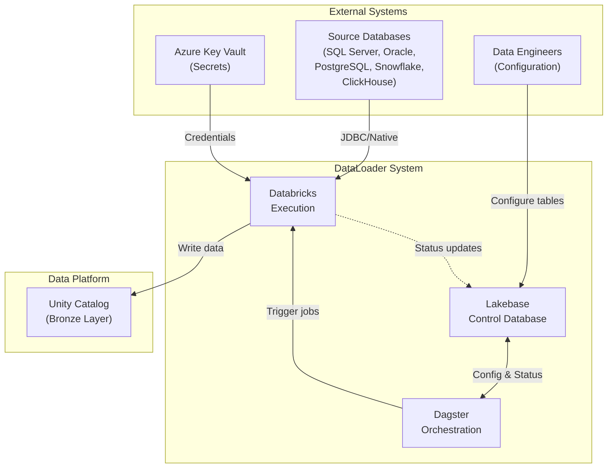
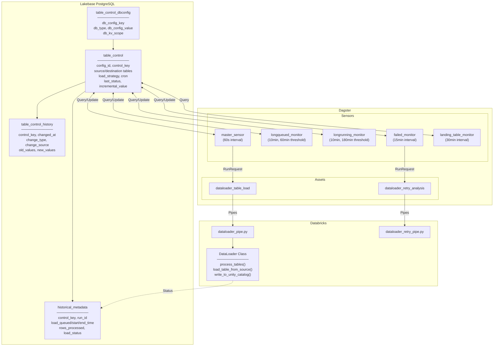
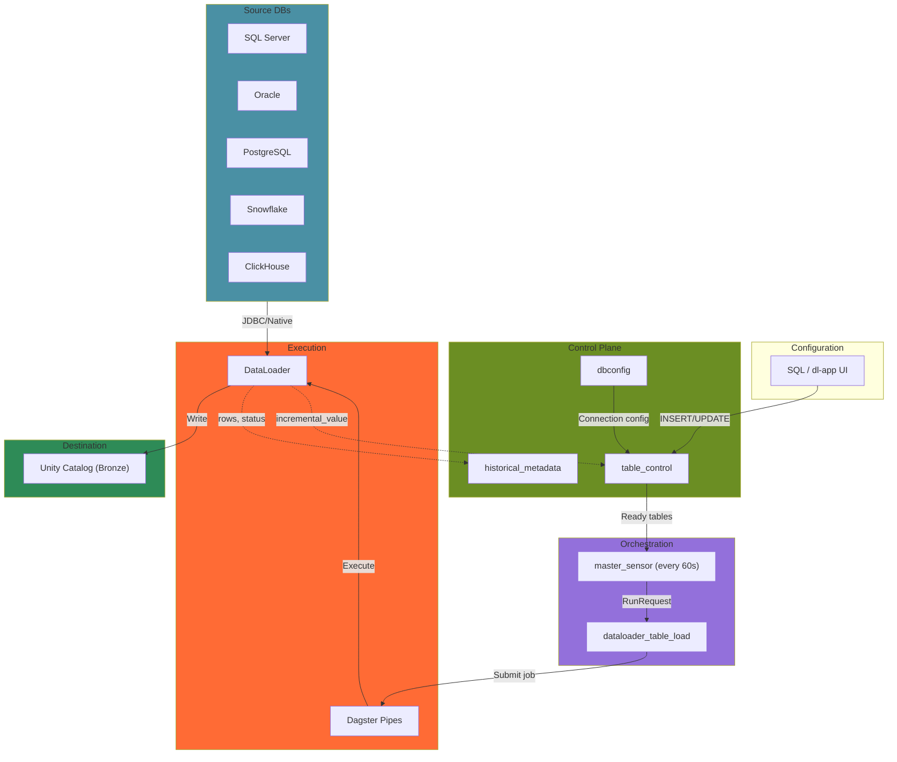
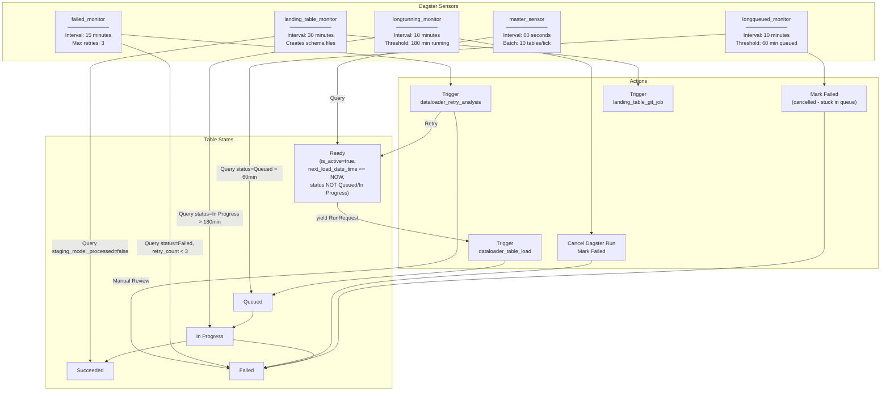
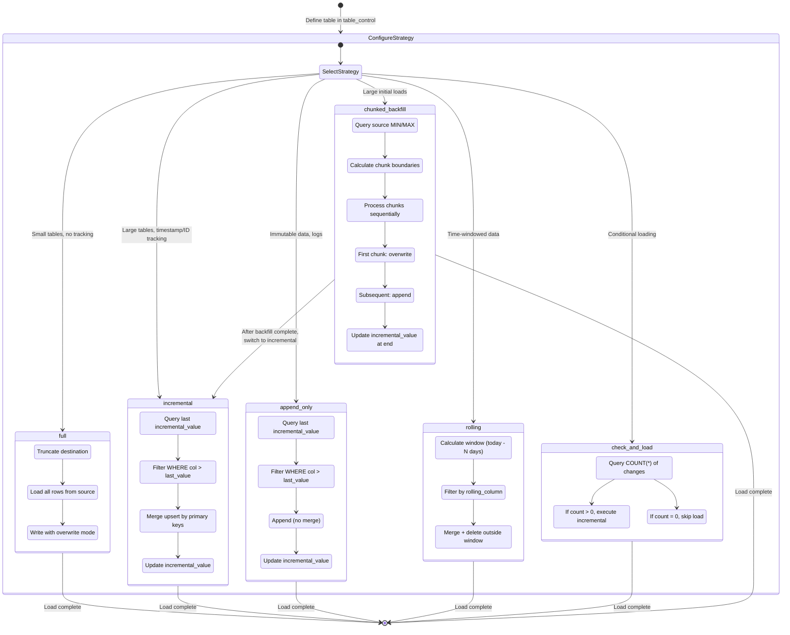
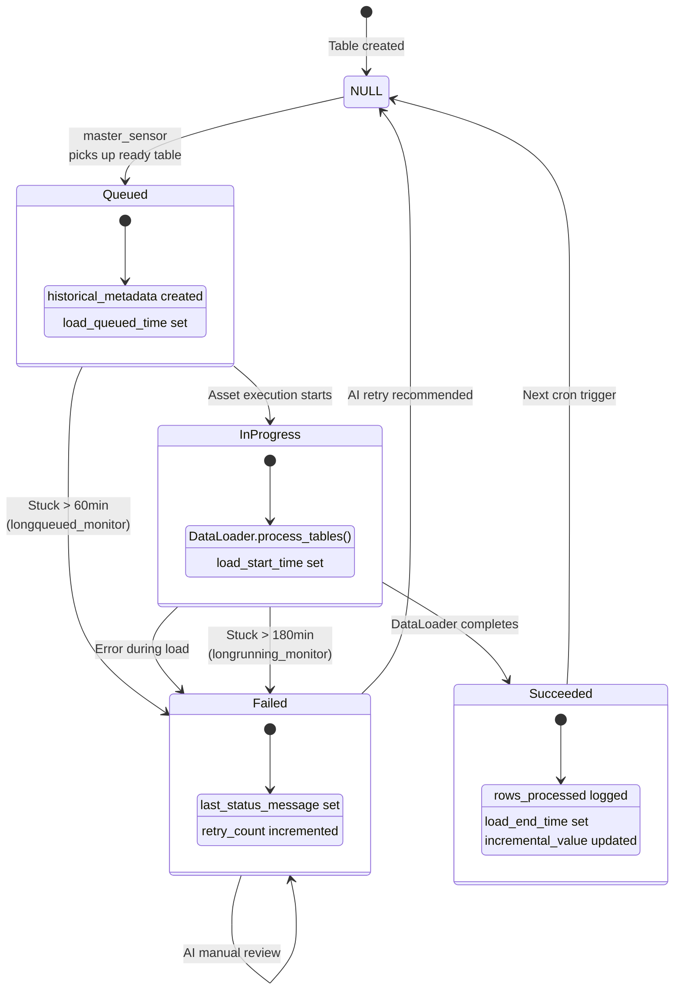
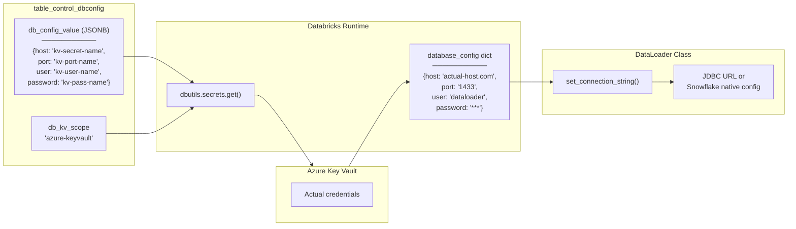

# Architecture Diagrams

Detailed Mermaid diagrams showing DataLoader system architecture.

---

## 1. System Context Diagram

Shows the DataLoader system boundary and external interactions.

---

## 2. Component Diagram

Shows all internal components and their relationships.

---

## 3. Data Flow Diagram

Shows how data and control signals flow through the system.

---

## 4. Sensor Orchestration Diagram

Shows all 5 sensors and their responsibilities.

---

## 5. Load Strategy State Machine

Shows the 6 load strategies and their behaviors.

---

## 6. Status Lifecycle

Shows table status transitions during execution.

---

## 7. Database Connection Flow

Shows how credentials are resolved and connections established.

---

## Related Documentation

- [Sequence Diagrams](03-sequence-diagrams.md) - Step-by-step operation flows
- [Lakebase Reference](../reference/02-lakebase-control-database.md) - Control table details
- [Dagster Reference](../reference/03-dagster-orchestration.md) - Sensor and asset details
- [DataLoader Reference](../reference/04-dataloader-class.md) - Class methods and database support
