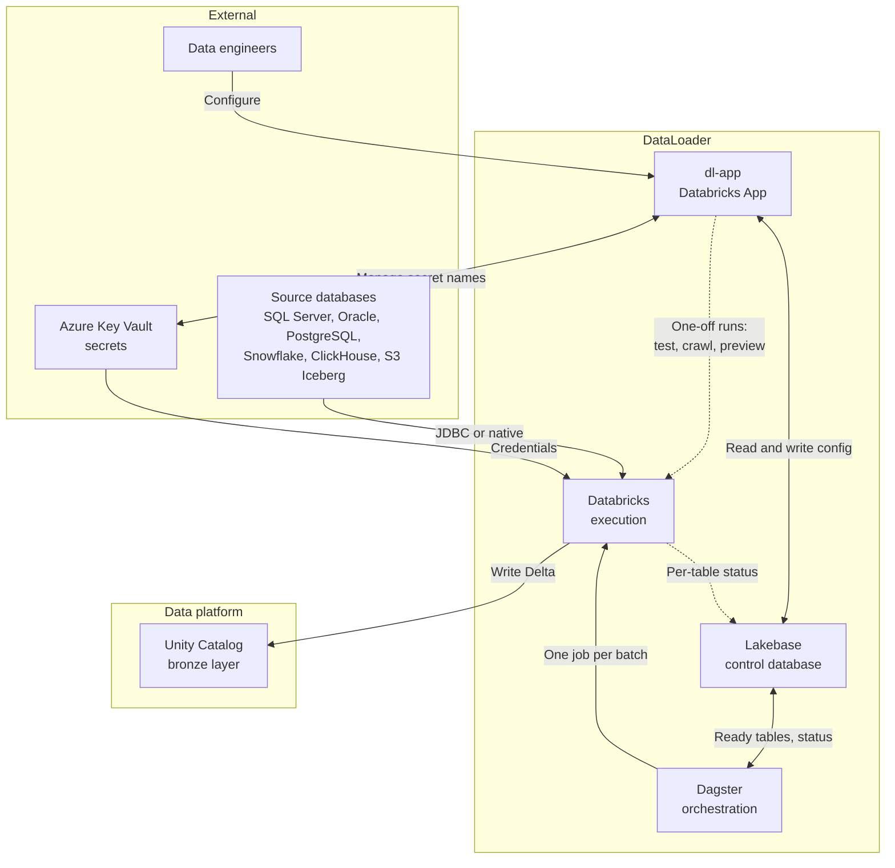
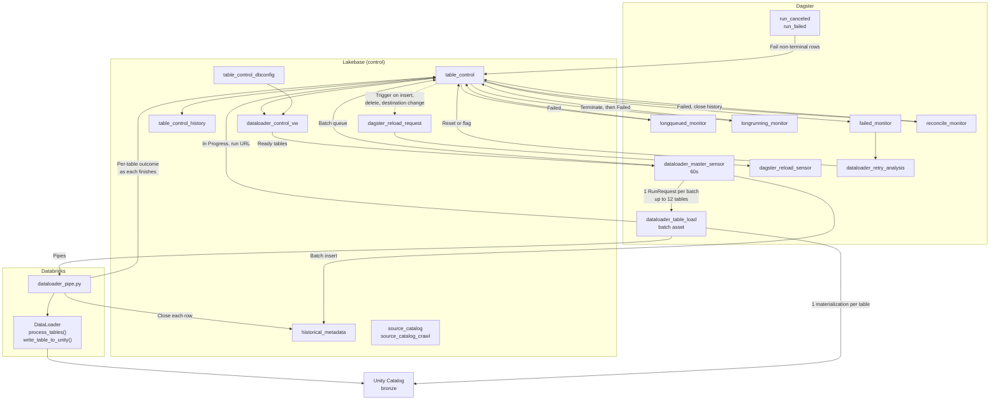
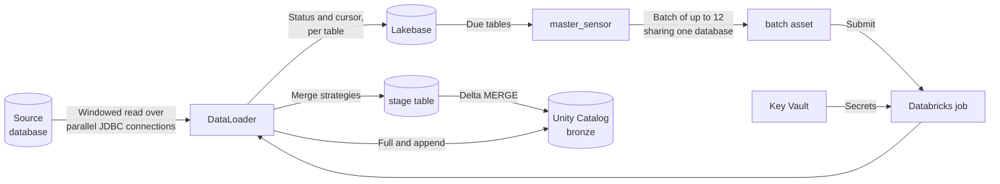
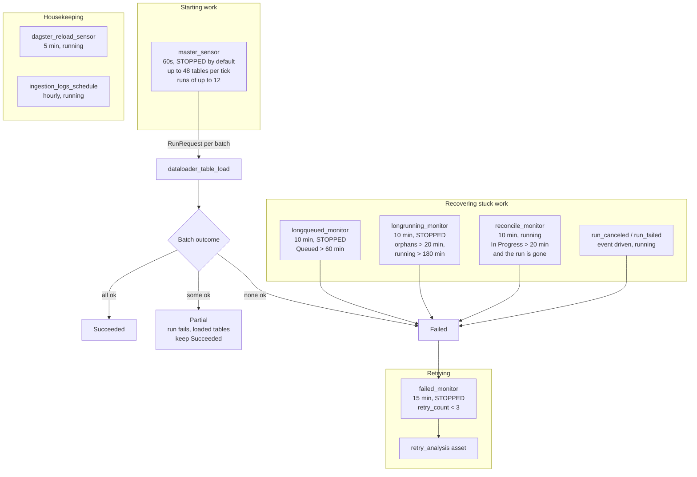
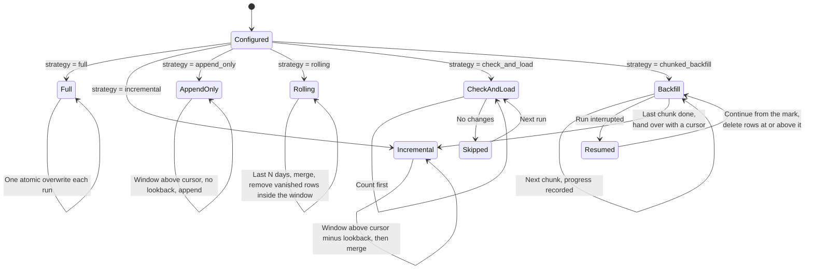
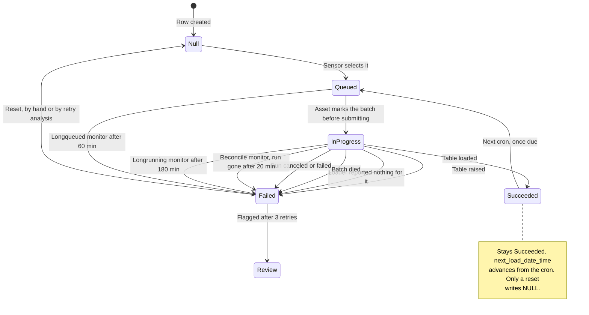
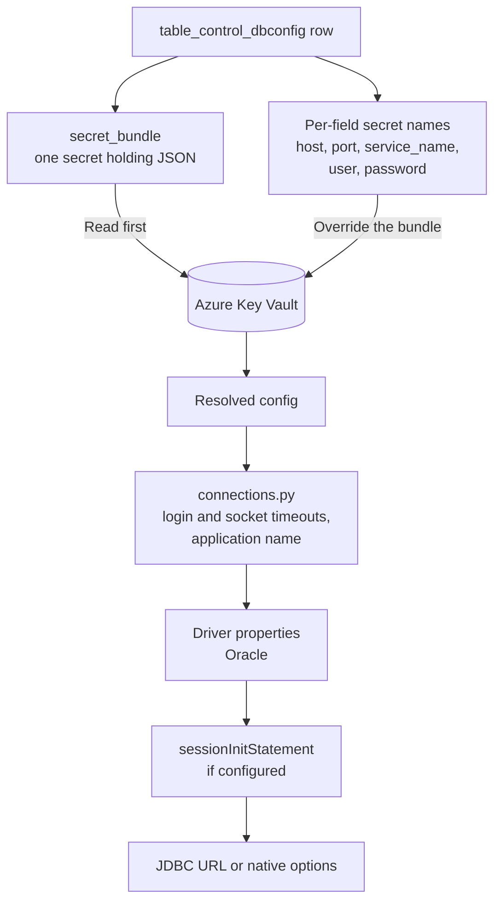

# Architecture Diagrams

Mermaid diagrams of the DataLoader system. Checked against `dbx-data@dev`.

---

## 1. System context

The system boundary and what it talks to.

```mermaid
flowchart TB
    subgraph External["External"]
        Sources["Source databases<br/>SQL Server, Oracle, PostgreSQL,<br/>Snowflake, ClickHouse, S3 Iceberg"]
        KeyVault["Azure Key Vault<br/>secrets"]
        Users["Data engineers"]
    end

    subgraph System["DataLoader"]
        App["dl-app<br/>Databricks App"]
        Lakebase["Lakebase<br/>control database"]
        Dagster["Dagster<br/>orchestration"]
        Databricks["Databricks<br/>execution"]
    end

    subgraph Dest["Data platform"]
        Unity["Unity Catalog<br/>bronze layer"]
    end

    Users -->|Configure| App
    App <-->|Read and write config| Lakebase
    App -.->|One-off runs:<br/>test, crawl, preview| Databricks
    App <-->|Manage secret names| KeyVault
    Lakebase <-->|Ready tables, status| Dagster
    Dagster -->|One job per batch| Databricks
    Sources -->|JDBC or native| Databricks
    KeyVault -->|Credentials| Databricks
    Databricks -->|Write Delta| Unity
    Databricks -.->|Per-table status| Lakebase
```

---

## 2. Components

```mermaid
flowchart TB
    subgraph LB["Lakebase (control)"]
        TC["table_control"]
        VW["dataloader_control_vw"]
        DBC["table_control_dbconfig"]
        HM["historical_metadata"]
        TCH["table_control_history"]
        SC["source_catalog<br/>source_catalog_crawl"]
        RR["dagster_reload_request"]
    end

    subgraph DG["Dagster"]
        MS["dataloader_master_sensor<br/>60s"]
        LQM["longqueued_monitor"]
        LRM["longrunning_monitor"]
        FM["failed_monitor"]
        RM["reconcile_monitor"]
        RS["run_canceled<br/>run_failed"]
        RLS["dagster_reload_sensor"]
        ATL["dataloader_table_load<br/>batch asset"]
        ARA["dataloader_retry_analysis"]
    end

    subgraph DBX["Databricks"]
        PIPE["dataloader_pipe.py"]
        DL["DataLoader<br/>process_tables()<br/>write_table_to_unity()"]
    end

    UC["Unity Catalog<br/>bronze"]

    TC --> VW
    DBC --> VW
    VW -->|Ready tables| MS
    MS -->|1 RunRequest per batch<br/>up to 12 tables| ATL
    MS -->|Batch insert| HM
    MS -->|Batch queue| TC
    ATL -->|In Progress, run URL| TC
    ATL -->|Pipes| PIPE
    PIPE --> DL
    DL --> UC
    PIPE -->|Per-table outcome<br/>as each finishes| TC
    PIPE -->|Close each row| HM
    ATL -->|1 materialization per table| UC

    TC --> LQM
    TC --> LRM
    TC --> FM
    TC --> RM
    LQM -->|Failed| TC
    LRM -->|Terminate, then Failed| TC
    RM -->|Failed, close history| TC
    RS -->|Fail non-terminal rows| TC
    FM --> ARA
    ARA -->|Reset or flag| TC

    TC -.->|Trigger on insert,<br/>delete, destination change| RR
    RR --> RLS
    TC --> TCH
```

`write_to_unity_catalog()` does not exist; the method is `write_table_to_unity()`.

---

## 3. Data flow

```mermaid
flowchart LR
    Src[(Source<br/>database)]
    KV[Key Vault]
    LB[(Lakebase)]
    Sensor[master_sensor]
    Asset[batch asset]
    Job[Databricks job]
    Loader[DataLoader]
    Stage[(stage table)]
    Dest[(Unity Catalog<br/>bronze)]

    LB -->|Due tables| Sensor
    Sensor -->|Batch of up to 12<br/>sharing one database| Asset
    Asset -->|Submit| Job
    KV -->|Secrets| Job
    Job --> Loader
    Src -->|Windowed read over<br/>parallel JDBC connections| Loader
    Loader -->|Merge strategies| Stage
    Stage -->|Delta MERGE| Dest
    Loader -->|Full and append| Dest
    Loader -->|Status and cursor,<br/>per table| LB
```

---

## 4. Sensors

Eight sensors and one schedule. Four ship stopped.

```mermaid
flowchart TB
    subgraph Work["Starting work"]
        MS["master_sensor<br/>60s, STOPPED by default<br/>up to 48 tables per tick<br/>runs of up to 12"]
    end

    subgraph Recover["Recovering stuck work"]
        LQM["longqueued_monitor<br/>10 min, STOPPED<br/>Queued &gt; 60 min"]
        LRM["longrunning_monitor<br/>10 min, STOPPED<br/>orphans &gt; 20 min,<br/>running &gt; 180 min"]
        RM["reconcile_monitor<br/>10 min, running<br/>In Progress &gt; 20 min<br/>and the run is gone"]
        RS["run_canceled / run_failed<br/>event driven, running"]
    end

    subgraph Retry["Retrying"]
        FM["failed_monitor<br/>15 min, STOPPED<br/>retry_count &lt; 3"]
        ARA["retry_analysis asset"]
    end

    subgraph Housekeeping["Housekeeping"]
        RLS["dagster_reload_sensor<br/>5 min, running"]
        ILS["ingestion_logs_schedule<br/>hourly, running"]
    end

    MS -->|RunRequest per batch| Load["dataloader_table_load"]
    Load --> Outcome{"Batch outcome"}
    Outcome -->|all ok| Succ["Succeeded"]
    Outcome -->|some ok| Part["Partial<br/>run fails, loaded tables<br/>keep Succeeded"]
    Outcome -->|none ok| Fail["Failed"]

    LQM --> Fail
    LRM --> Fail
    RM --> Fail
    RS --> Fail
    Fail --> FM
    FM --> ARA
```

---

## 5. Load strategy state machine

```mermaid
stateDiagram-v2
    [*] --> Configured

    Configured --> Full: strategy = full
    Configured --> Incremental: strategy = incremental
    Configured --> AppendOnly: strategy = append_only
    Configured --> Rolling: strategy = rolling
    Configured --> CheckAndLoad: strategy = check_and_load
    Configured --> Backfill: strategy = chunked_backfill

    Full --> Full: One atomic overwrite each run

    Incremental --> Incremental: Window above cursor minus lookback, then merge
    AppendOnly --> AppendOnly: Window above cursor, no lookback, append
    Rolling --> Rolling: Last N days, merge, remove vanished rows inside the window

    CheckAndLoad --> CheckAndLoad: Count first
    CheckAndLoad --> Skipped: No changes
    Skipped --> CheckAndLoad: Next run

    Backfill --> Backfill: Next chunk, progress recorded
    Backfill --> Resumed: Run interrupted
    Resumed --> Backfill: Continue from the mark,<br/>delete rows at or above it
    Backfill --> Incremental: Last chunk done,<br/>hand over with a cursor
```

A forced full reload (`load_full`) bypasses the window on incremental, append_only and rolling,
because the write overwrites the destination.

---

## 6. Status lifecycle

```mermaid
stateDiagram-v2
    [*] --> Null: Row created

    Null --> Queued: Sensor selects it
    Succeeded --> Queued: Next cron, once due
    Queued --> InProgress: Asset marks the batch before submitting
    InProgress --> Succeeded: Table loaded
    InProgress --> Failed: Table raised
    InProgress --> Failed: Loader reported nothing for it
    InProgress --> Failed: Batch died
    InProgress --> Failed: Run canceled or failed
    InProgress --> Failed: Reconcile monitor, run gone after 20 min
    InProgress --> Failed: Longrunning monitor after 180 min
    Queued --> Failed: Longqueued monitor after 60 min

    Failed --> Null: Reset, by hand or by retry analysis
    Failed --> Review: Flagged after 3 retries

    note right of Succeeded
        Stays Succeeded. next_load_date_time
        advances from the cron. Only a reset
        writes NULL.
    end note
```

A row only re-qualifies for a run when `last_status` is NULL or `Succeeded`. A row left at `Failed`
never runs again until something resets it.

---

## 7. Connection resolution

```mermaid
flowchart TB
    Row["table_control_dbconfig row"]
    Bundle["secret_bundle<br/>one secret holding JSON"]
    Fields["Per-field secret names<br/>host, port, service_name,<br/>user, password"]
    KV[(Azure Key Vault)]
    Merged["Resolved config"]
    Suffix["connections.py<br/>login and socket timeouts,<br/>application name"]
    Props["Driver properties<br/>Oracle"]
    Init["sessionInitStatement<br/>if configured"]
    JDBC["JDBC URL or native options"]

    Row --> Bundle
    Row --> Fields
    Bundle -->|Read first| KV
    Fields -->|Override the bundle| KV
    KV --> Merged
    Merged --> Suffix
    Suffix --> Props
    Props --> Init
    Init --> JDBC
```

Per-field secrets override the bundle, so one field can be rotated without rewriting the bundle.

---

## Related documentation

- [System Overview](../reference/01-system-overview.md)
- [Dagster Orchestration](../reference/03-dagster-orchestration.md)
- [Sequence Diagrams](03-sequence-diagrams.md)
