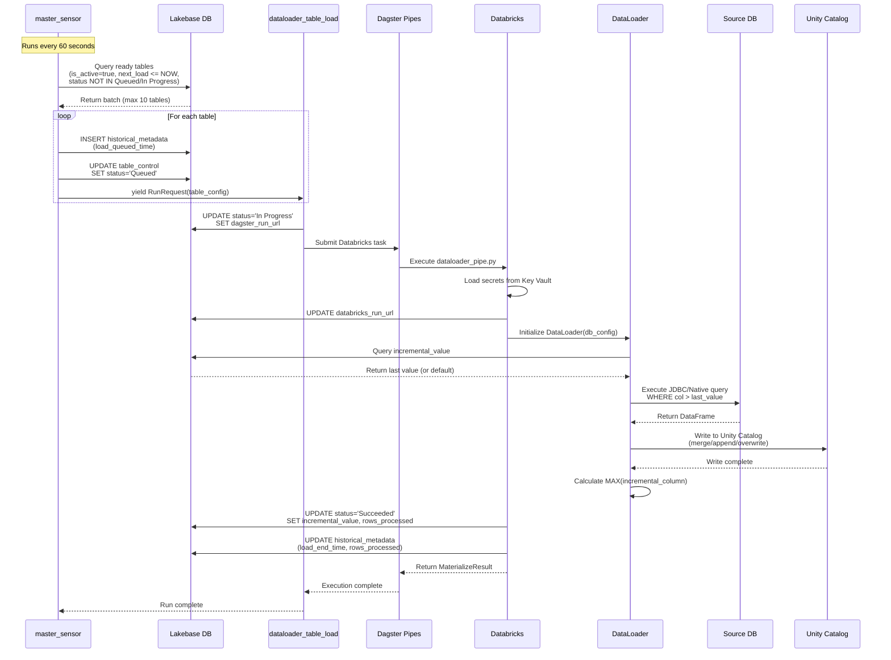
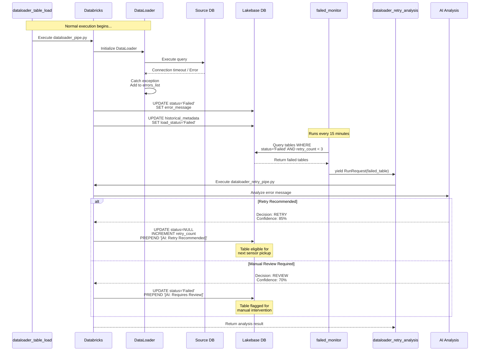
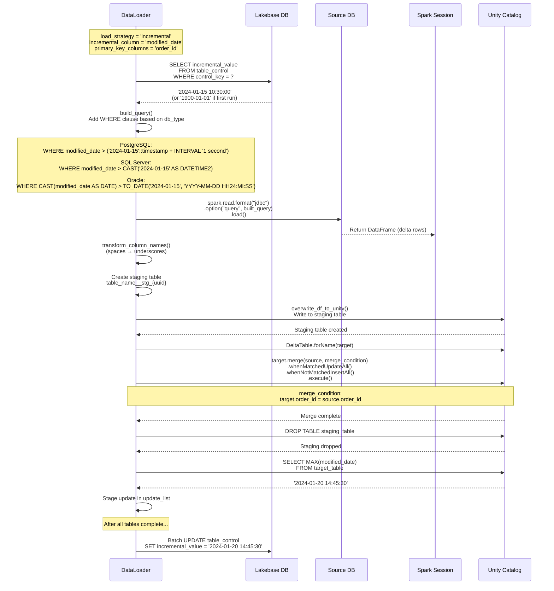
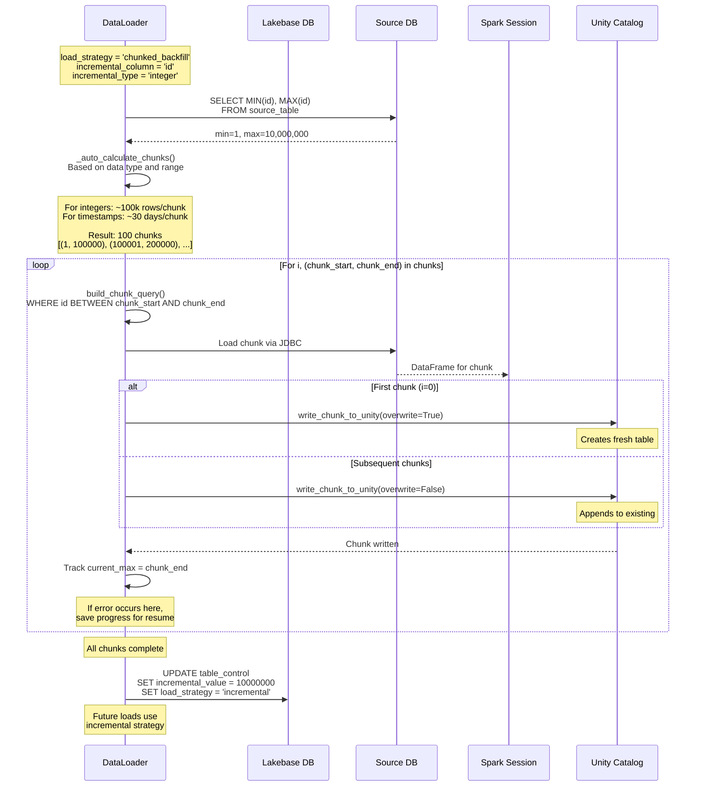
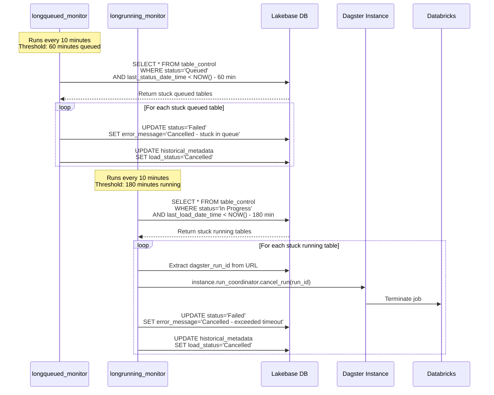

# Sequence Diagrams

Step-by-step sequences for key DataLoader operations.

---

## 1. Successful Table Load

Complete sequence from sensor trigger to successful completion.

---

## 2. Failed Load with AI Retry

Sequence showing failure detection and AI-powered retry analysis.

---

## 3. Incremental Load Details

Detailed sequence showing incremental value tracking and delta processing.

---

## 4. Chunked Backfill Flow

Sequence for loading large tables in sequential chunks.

---

## 5. Timeout Handling

Sequence showing how stuck jobs are detected and handled.

---

## Related Documentation

- [Architecture Diagrams](02-architecture.md) - Component and flow diagrams
- [Dagster Orchestration](../reference/03-dagster-orchestration.md) - Sensor details
- [Load Strategies](../reference/05-load-strategies.md) - Strategy configuration
- [Troubleshooting](../reference/06-troubleshooting.md) - Debugging failed loads
