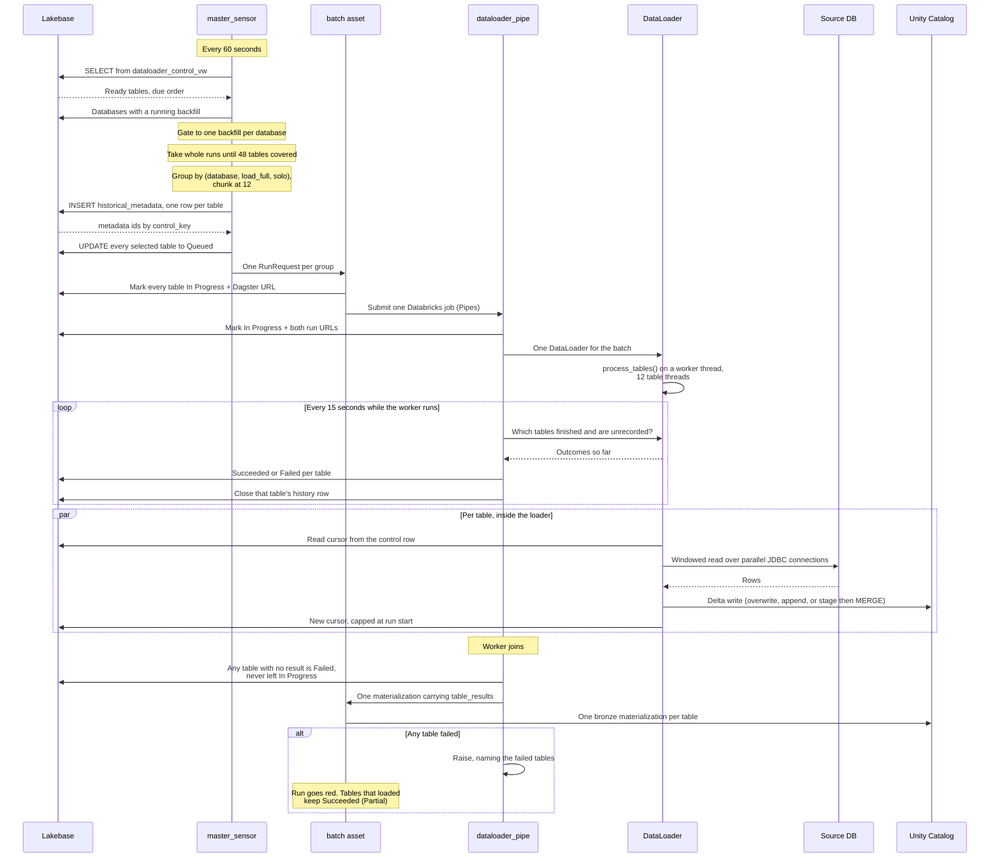
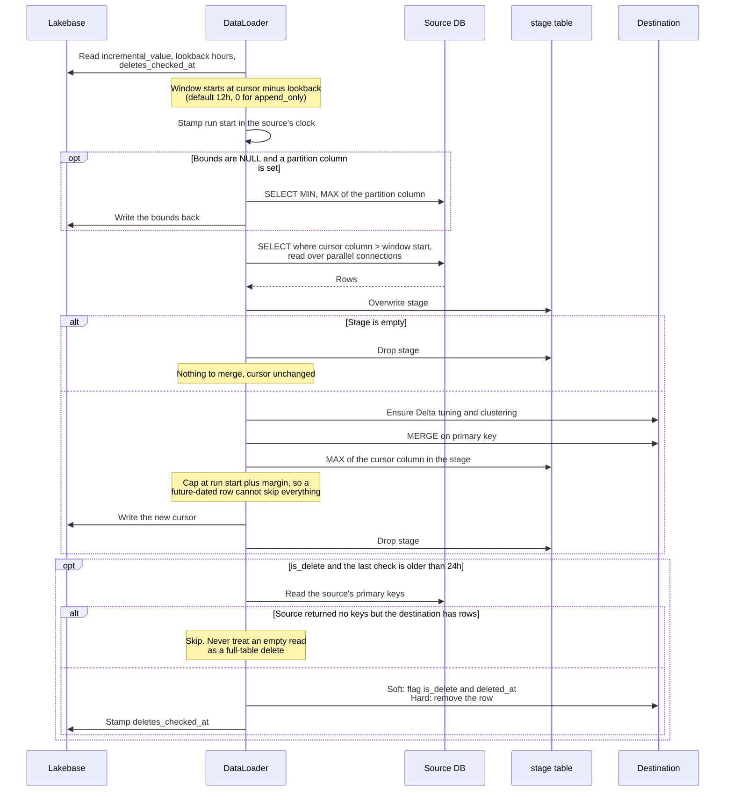
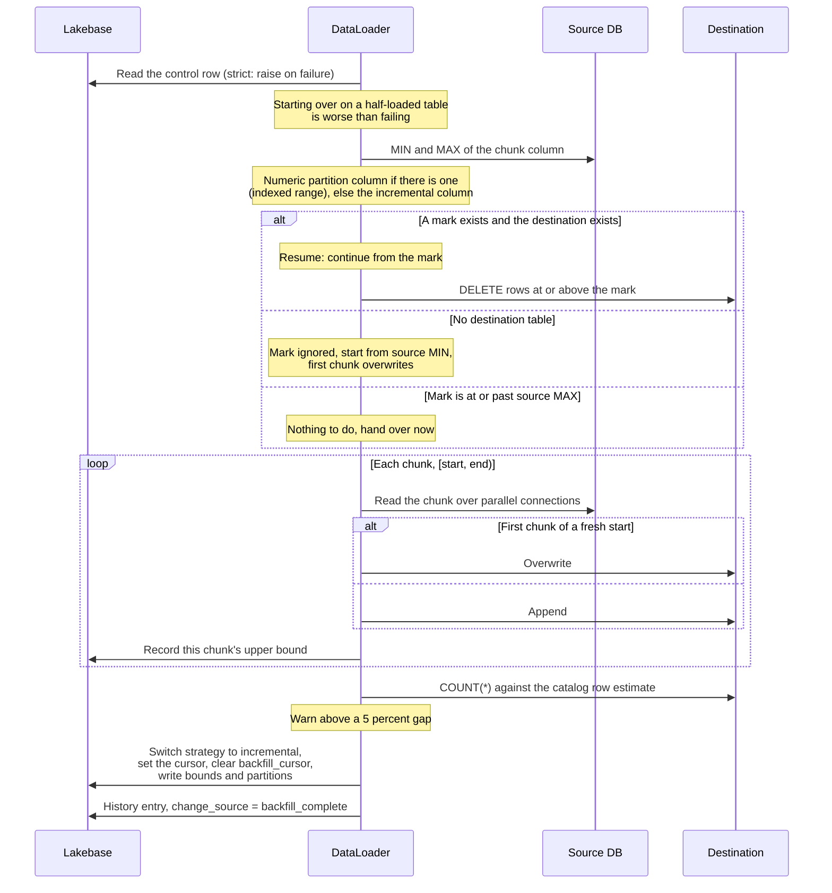
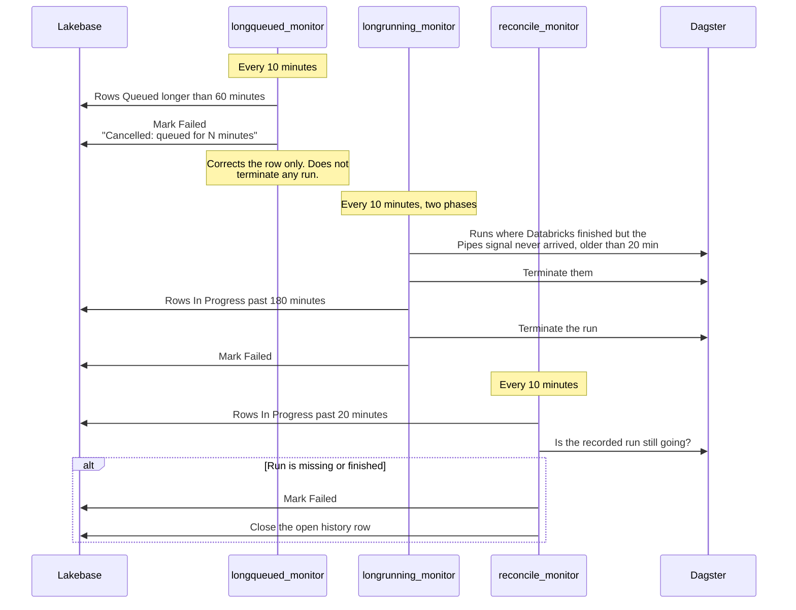

# Sequence Diagrams

Step by step sequences for the operations worth understanding in detail. Checked against
`dbx-data@dev`.

---

## 1. A batch loads

The sensor selects tables, groups them, and one run loads up to twelve of them. Per-table outcomes
are written as each table finishes, not at the end.

```mermaid
sequenceDiagram
    participant LB as Lakebase
    participant MS as master_sensor
    participant AS as batch asset
    participant PIPE as dataloader_pipe
    participant DL as DataLoader
    participant SRC as Source DB
    participant UC as Unity Catalog

    Note over MS: Every 60 seconds

    MS->>LB: SELECT from dataloader_control_vw
    LB-->>MS: Ready tables, due order
    MS->>LB: Databases with a running backfill
    Note over MS: Gate to one backfill per database
    Note over MS: Take whole runs until 48 tables covered
    Note over MS: Group by (database, load_full, solo),<br/>chunk at 12

    MS->>LB: INSERT historical_metadata, one row per table
    LB-->>MS: metadata ids by control_key
    MS->>LB: UPDATE every selected table to Queued
    MS->>AS: One RunRequest per group

    AS->>LB: Mark every table In Progress + Dagster URL
    AS->>PIPE: Submit one Databricks job (Pipes)

    PIPE->>LB: Mark In Progress + both run URLs
    PIPE->>DL: One DataLoader for the batch
    DL->>DL: process_tables() on a worker thread,<br/>12 table threads

    loop Every 15 seconds while the worker runs
        PIPE->>DL: Which tables finished and are unrecorded?
        DL-->>PIPE: Outcomes so far
        PIPE->>LB: Succeeded or Failed per table
        PIPE->>LB: Close that table's history row
    end

    par Per table, inside the loader
        DL->>LB: Read cursor from the control row
        DL->>SRC: Windowed read over parallel JDBC connections
        SRC-->>DL: Rows
        DL->>UC: Delta write (overwrite, append, or stage then MERGE)
        DL->>LB: New cursor, capped at run start
    end

    Note over PIPE: Worker joins
    PIPE->>LB: Any table with no result is Failed,<br/>never left In Progress
    PIPE->>AS: One materialization carrying table_results
    AS->>UC: One bronze materialization per table

    alt Any table failed
        PIPE->>PIPE: Raise, naming the failed tables
        Note over AS: Run goes red. Tables that loaded<br/>keep Succeeded (Partial)
    end
```

---

## 2. A batch fails

One table failing does not fail its siblings. A batch dying does, and three layers catch it.

```mermaid
sequenceDiagram
    participant LB as Lakebase
    participant AS as batch asset
    participant PIPE as dataloader_pipe
    participant DL as DataLoader
    participant RS as run status sensors
    participant RM as reconcile_monitor

    alt One table raises, the batch survives
        DL-->>PIPE: That table is in errors_list
        PIPE->>LB: That table Failed, with its real error
        Note over PIPE: The other 11 keep their own outcomes.<br/>Batch rolls up to Partial and raises.
    else The batch dies after starting
        PIPE->>LB: Every unresolved table Failed<br/>with the batch error
        Note over PIPE: Already terminal tables keep their outcome
    else The job submission raises
        AS->>LB: Read each table's current status
        AS->>LB: Fail only rows not already terminal
    else The run is canceled or dies outside the asset
        RS->>LB: Read config.tables[*].config_id from the run config
        RS->>LB: Fail only non-terminal rows
    else Nothing above ran, run config unreadable
        Note over RM: 10 minutes later
        RM->>LB: Rows In Progress &gt; 20 min whose<br/>last_dagster_run is gone or finished
        RM->>LB: Mark Failed, close orphaned history rows
    end
```

The last branch is the backstop added after the September 2026 outage, when rows sat In Progress for
days because the runs that owned them had been killed.

---

## 3. An incremental load

```mermaid
sequenceDiagram
    participant LB as Lakebase
    participant DL as DataLoader
    participant SRC as Source DB
    participant STG as stage table
    participant DEST as Destination

    DL->>LB: Read incremental_value, lookback hours,<br/>deletes_checked_at
    Note over DL: Window starts at cursor minus lookback<br/>(default 12h, 0 for append_only)
    DL->>DL: Stamp run start in the source's clock

    opt Bounds are NULL and a partition column is set
        DL->>SRC: SELECT MIN, MAX of the partition column
        DL->>LB: Write the bounds back
    end

    DL->>SRC: SELECT where cursor column > window start,<br/>read over parallel connections
    SRC-->>DL: Rows

    DL->>STG: Overwrite stage
    alt Stage is empty
        DL->>STG: Drop stage
        Note over DL: Nothing to merge, cursor unchanged
    else
        DL->>DEST: Ensure Delta tuning and clustering
        DL->>DEST: MERGE on primary key
        DL->>STG: MAX of the cursor column in the stage
        Note over DL: Cap at run start plus margin, so a<br/>future-dated row cannot skip everything
        DL->>LB: Write the new cursor
        DL->>STG: Drop stage
    end

    opt is_delete and the last check is older than 24h
        DL->>SRC: Read the source's primary keys
        alt Source returned no keys but the destination has rows
            Note over DL: Skip. Never treat an empty read<br/>as a full-table delete
        else
            DL->>DEST: Soft: flag is_delete and deleted_at<br/>Hard: remove the row
            DL->>LB: Stamp deletes_checked_at
        end
    end
```

The lookback and the cap exist because the naive version loses rows: late commits fall below the
cursor, and one bad future timestamp moves the cursor past everything behind it.

---

## 4. A chunked backfill

```mermaid
sequenceDiagram
    participant LB as Lakebase
    participant DL as DataLoader
    participant SRC as Source DB
    participant DEST as Destination

    DL->>LB: Read the control row (strict: raise on failure)
    Note over DL: Starting over on a half-loaded table<br/>is worse than failing

    DL->>SRC: MIN and MAX of the chunk column
    Note over DL: Numeric partition column if there is one<br/>(indexed range), else the incremental column

    alt A mark exists and the destination exists
        Note over DL: Resume: continue from the mark
        DL->>DEST: DELETE rows at or above the mark
    else No destination table
        Note over DL: Mark ignored, start from source MIN,<br/>first chunk overwrites
    else Mark is at or past source MAX
        Note over DL: Nothing to do, hand over now
    end

    loop Each chunk, [start, end)
        DL->>SRC: Read the chunk over parallel connections
        alt First chunk of a fresh start
            DL->>DEST: Overwrite
        else
            DL->>DEST: Append
        end
        DL->>LB: Record this chunk's upper bound
    end

    DL->>DEST: COUNT(*) against the catalog row estimate
    Note over DL: Warn above a 5 percent gap

    DL->>LB: Switch strategy to incremental,<br/>set the cursor, clear backfill_cursor,<br/>write bounds and partitions
    DL->>LB: History entry, change_source = backfill_complete
```

A backfill runs alone, one per source database, with a 24 hour job timeout. The destination is
partial while it runs, because the first chunk replaces the table.

---

## 5. Timeouts and stuck rows

```mermaid
sequenceDiagram
    participant LB as Lakebase
    participant LQM as longqueued_monitor
    participant LRM as longrunning_monitor
    participant RM as reconcile_monitor
    participant DG as Dagster

    Note over LQM: Every 10 minutes
    LQM->>LB: Rows Queued longer than 60 minutes
    LQM->>LB: Mark Failed<br/>"Cancelled: queued for N minutes"
    Note over LQM: Corrects the row only. Does not<br/>terminate any run.

    Note over LRM: Every 10 minutes, two phases
    LRM->>DG: Runs where Databricks finished but the<br/>Pipes signal never arrived, older than 20 min
    LRM->>DG: Terminate them
    LRM->>LB: Rows In Progress past 180 minutes
    LRM->>DG: Terminate the run
    LRM->>LB: Mark Failed

    Note over RM: Every 10 minutes
    RM->>LB: Rows In Progress past 20 minutes
    RM->>DG: Is the recorded run still going?
    alt Run is missing or finished
        RM->>LB: Mark Failed
        RM->>LB: Close the open history row
    end
```

---

## Related documentation

- [Architecture Diagrams](02-architecture.md)
- [Dagster Orchestration](../reference/03-dagster-orchestration.md)
- [Load Strategies](../reference/05-load-strategies.md)
- [Troubleshooting](../reference/06-troubleshooting.md)
