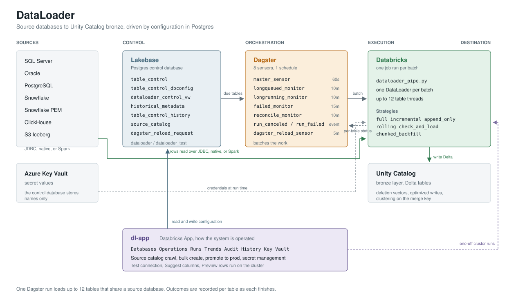

# DataLoader

DataLoader moves data from source databases into the Databricks Unity Catalog bronze layer. What
loads, how, and on what schedule is configuration in a Postgres database, not code. Adding a table
is a row, not a deployment.

-   :material-book-open-variant: **New here**

    ---

    What the system is, the words it uses, and how one load gets from a row in Postgres to a Delta
    table.

    [:octicons-arrow-right-24: System overview](reference/01-system-overview.md)

-   :material-clipboard-check: **I need to do a thing**

    ---

    Add tables in bulk, reload one, backfill a huge table, handle a changed source column, promote
    to prod.

    [:octicons-arrow-right-24: Common tasks](reference/08-common-tasks.md)

-   :material-alert-circle: **Something is broken**

    ---

    A table never runs, a load failed, a row is stuck, rows are silently missing. Organized by
    symptom.

    [:octicons-arrow-right-24: Troubleshooting](reference/06-troubleshooting.md)

-   :material-monitor-dashboard: **Using the app**

    ---

    Every screen of dl-app, what each control does, and the five buttons that talk to a real
    cluster.

    [:octicons-arrow-right-24: Control Manager UI](reference/07-control-manager-ui.md)

---

## The three things that surprise people

**One run loads up to twelve tables.** Loads are batched. The sensor groups the tables that are due
by source database, and one run loads them on parallel threads. A run is not a table. Outcomes are
recorded per table as each finishes, so one bad table does not fail the other eleven.

**A failed row never runs again on its own.** The view the sensor reads only re-qualifies a row
whose last status is `Succeeded` or NULL. A row sitting at `Failed` waits for a reset, however many
times its cron fires.

**dl-app is the system's front door**, not a developer convenience. It is a deployed Databricks App.
Configuring databases and tables, watching loads, crawling a source catalog, promoting to production
and managing secrets all happen there.

---

## How it fits together

| Layer | What it is | What it does |
|---|---|---|
| Control | Lakebase, a Postgres database | Holds what to load, how, when, and what happened last time |
| Orchestration | Dagster, self-hosted | Watches the control plane, batches the work, starts runs |
| Execution | Databricks | Reads the source, writes Delta, reports each table's outcome |
| Destination | Unity Catalog | The bronze layer |
| Interface | dl-app | How people operate all of the above |

---

## Vocabulary

Worth knowing before reading anything else.

| Term | Meaning |
|---|---|
| **Control row** | One row of `table_control`. One source table, its destination, strategy and schedule |
| **Strategy** | How a table loads: `full`, `incremental`, `append_only`, `rolling`, `check_and_load`, `chunked_backfill` |
| **Cursor** | The high-water mark (`incremental_value`) an incremental load reads above |
| **Lookback** | Hours below the cursor that get re-read anyway, so rows that committed late are not missed |
| **Batch** | The set of tables loaded by one run, sharing one source database |
| **Partial** | A batch where some tables loaded and some failed. The run goes red, the loaded tables keep `Succeeded` |
| **Crawl** | Caching a source database's tables, columns, keys and indexes so configs can be created in bulk |
| **Change column** | A column whose name says it moves when a row is edited. The crawl ranks candidates for you |
| **Promote** | Copying configuration from the test control database to production. Never moves data |
| **Reset** | Clearing a table's status so the next sensor tick picks it up |

---

## Reference

| Page | Covers |
|---|---|
| [Load strategies](reference/05-load-strategies.md) | The six strategies, cursors, deletes, backfills |
| [Control database](reference/02-lakebase-control-database.md) | Every table and column, the view the sensor reads, diagnostic queries |
| [Orchestration](reference/03-dagster-orchestration.md) | Batching, all eight sensors, how a batch failure is attributed |
| [The loader](reference/04-dataloader-class.md) | The DataLoader class and the modules around it |
| [Architecture diagrams](diagrams/02-architecture.md) | Components, data flow, state machines |
| [Sequence diagrams](diagrams/03-sequence-diagrams.md) | Batch load, batch failure, incremental, backfill, timeouts |

---

Every claim on this site is checked against the `AnteroDataLakehouse` repository on its `dev`
branch. When the code and these pages disagree, the pages are wrong. Please fix them.
