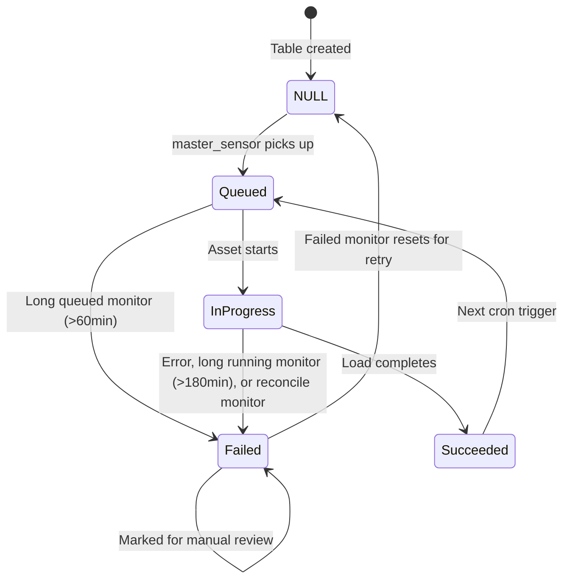

# Lakebase Control Database

Lakebase is the PostgreSQL control database that drives the DataLoader orchestration system.

---

## Overview

| Property | Value |
|----------|-------|
| **Engine** | PostgreSQL |
| **Production Database** | `dataloader` |
| **Pre-production Database** | `dataloader_test` |
| **Schema** | `control` |
| **Connection** | `sslmode=require`, 10s connect timeout, 30s statement timeout (`dagsters/utils/lakebase_client.py`) |
| **Schema changes** | dbmate migrations in `db/migrations`, applied only by the Lakebase Migrations pipeline |

### How the schema changes

`sql/01_create_tables.sql`, `02_create_indexes.sql` and `03_create_views.sql` are the original
baseline. Everything since is a dbmate migration in `db/migrations`, applied by the **Lakebase
Migrations** Azure DevOps pipeline with `dbmate up --strict`: against `dataloader_test` on a merge
to `dev`, against `dataloader` on a merge to `prod`. Nobody applies SQL by hand. Applied versions
are recorded in `control.schema_migrations` (see `db/README.md`).

`--strict` refuses a migration older than one already applied, which catches a stale branch that
merged late. `sql/migrations/001` to `005` predate dbmate, were applied by hand, and are not
tracked in `schema_migrations`.

The DDL below is the effective shape: baseline plus every migration, not a copy of any one file.

---

## Tables

### 1. table_control_dbconfig

Stores database connection configurations as JSONB.

```sql
CREATE TABLE control.table_control_dbconfig (
    db_config_key VARCHAR(100) PRIMARY KEY,
    db_config_value JSONB NOT NULL,
    db_type VARCHAR(50) NOT NULL,
    db_kv_scope VARCHAR(100) DEFAULT 'azure-keyvault',
    default_target_schema VARCHAR(255),

    -- Audit
    created_at TIMESTAMP DEFAULT CURRENT_TIMESTAMP,
    last_modified_at TIMESTAMP DEFAULT CURRENT_TIMESTAMP,
    create_user VARCHAR(255),
    last_modified_user VARCHAR(255)
);
```

**Key Columns**:

| Column | Type | Description |
|--------|------|-------------|
| `db_config_key` | VARCHAR(100) | Unique identifier (e.g., `sql_sales_prod`) |
| `db_config_value` | JSONB | Connection details (Key Vault secret names) |
| `db_type` | VARCHAR(50) | One of the seven types below |
| `db_kv_scope` | VARCHAR(100) | Key Vault scope for secret retrieval |
| `default_target_schema` | VARCHAR(255) | Default destination schema |

**db_config_value fields by db_type** (`dl-app/models.py`, `DB_CONFIG_FIELDS`). Every value is a
Key Vault secret name, never the secret itself.

| db_type | Fields |
|---------|--------|
| `clickhouse` | `host`, `port`, `service_name`, `user`, `password` |
| `mssql` | `host`, `port`, `service_name`, `user`, `password`, `tenant_id` (optional) |
| `oracle` | `host`, `port`, `service_name`, `user`, `password` |
| `postgresql` | `host`, `port`, `service_name`, `user`, `password` |
| `snowflake` | `url`, `user`, `password`, `service_name`, `warehouse` |
| `snowflake_pem` | `url`, `user`, `pem_private_key`, `service_name`, `warehouse` |
| `s3_iceberg` | `aws_access_key_id`, `aws_secret_access_key`, `aws_region`, `s3_warehouse` |

The JDBC types (`clickhouse`, `mssql`, `oracle`, `postgresql`) use `service_name` for the database
name, not `database`. The loader's JDBC URL templates read `service_name`, so a config written
with `database` fails to connect. Snowflake maps `url` to `sfUrl` and `service_name` to
`sfDatabase`. `tenant_id` is the only field allowed to be blank for its type
(`OPTIONAL_DB_CONFIG_FIELDS`).

```json
{
  "host": "kv-secret-name-for-host",
  "port": "kv-secret-name-for-port",
  "service_name": "kv-secret-name-for-database",
  "user": "kv-secret-name-for-user",
  "password": "kv-secret-name-for-password"
}
```

---

### 2. table_control

Master orchestration table defining what tables to load and when.

```sql
CREATE TABLE control.table_control (
    -- Primary key
    config_id BIGSERIAL PRIMARY KEY,

    -- Computed key (SHA-256 hash of source identifiers)
    control_key BYTEA GENERATED ALWAYS AS (
        digest(
            COALESCE(source_table_catalog, '') ||
            COALESCE(source_table_schema, '') ||
            COALESCE(source_table_name, ''),
            'sha256'
        )
    ) STORED,

    -- Status and control
    is_active BOOLEAN DEFAULT false NOT NULL,
    last_status VARCHAR(255),
    db_config_key VARCHAR(255),

    -- Source identification
    source_table_catalog VARCHAR(255),
    source_table_schema VARCHAR(255),
    source_table_name VARCHAR(255),
    query TEXT,  -- Optional custom SQL, replaces the source table reference

    -- Destination identification
    destination_table_catalog VARCHAR(255),
    destination_table_schema VARCHAR(255),
    destination_table_name VARCHAR(255),

    -- Load strategy
    load_strategy VARCHAR(255),
    load_full BOOLEAN DEFAULT false NOT NULL,
    load_cron VARCHAR(255),

    -- Incremental configuration
    incremental_column TEXT,
    incremental_type VARCHAR(255),
    incremental_value VARCHAR(255),
    incremental_lookback_hours INTEGER,
    backfill_cursor VARCHAR(255),

    -- Rolling configuration
    rolling_column TEXT,
    rolling_days INTEGER,

    -- Dev override
    dev_full_load BOOLEAN DEFAULT false,

    -- Delete handling
    is_delete BOOLEAN DEFAULT false,
    delete_mode VARCHAR(10) DEFAULT 'soft' NOT NULL,
    deletes_checked_at TIMESTAMP WITH TIME ZONE,

    -- Partitioning configuration
    num_partitions INTEGER,
    partition_column TEXT,
    lower_bound VARCHAR(255),
    upper_bound VARCHAR(255),
    primary_key_cols TEXT,

    -- Timing and status
    last_load_date_time TIMESTAMP,
    next_load_date_time TIMESTAMP,
    last_status_date_time TIMESTAMP,
    last_status_message TEXT,

    -- Run tracking
    last_dagster_run VARCHAR(500),
    last_databricks_run VARCHAR(500),

    -- Audit
    created_at TIMESTAMP DEFAULT CURRENT_TIMESTAMP,
    last_modified_at TIMESTAMP DEFAULT CURRENT_TIMESTAMP,
    create_user VARCHAR(255),
    last_modified_user VARCHAR(255),

    UNIQUE (source_table_catalog, source_table_schema, source_table_name, load_cron),
    CONSTRAINT table_control_delete_mode_check CHECK (delete_mode IN ('soft', 'hard')),
    CONSTRAINT table_control_lookback_hours_check
        CHECK (incremental_lookback_hours IS NULL OR incremental_lookback_hours >= 0)
);
```

**Key Columns**:

| Column | Type | Description |
|--------|------|-------------|
| `config_id` | BIGSERIAL | Surrogate primary key, the target of every status update |
| `control_key` | BYTEA | SHA-256 of source catalog + schema + name, each part wrapped in `COALESCE(..., '')`. Links to `historical_metadata`. Not unique: two schedules for one source table share it |
| `is_active` | BOOLEAN | Whether the table is enabled for loading |
| `last_status` | VARCHAR | `Queued`, `In Progress`, `Succeeded`, `Failed`, or NULL |
| `load_strategy` | VARCHAR | `full`, `incremental`, `append_only`, `rolling`, `check_and_load`, `chunked_backfill` |
| `load_full` | BOOLEAN | One-time full reload override. The loader clears it after a successful load |
| `incremental_value` | VARCHAR | Last processed value of `incremental_column` |
| `incremental_lookback_hours` | INTEGER | Hours below the cursor re-read each run to catch late commits. NULL uses the loader default `DATALOADER_INCREMENTAL_LOOKBACK_HOURS` (12) |
| `backfill_cursor` | VARCHAR | Chunked backfill progress: upper bound of the last completed chunk on `partition_column`. NULL when no backfill is running |
| `dev_full_load` | BOOLEAN | Bypasses the dev row limit for this table |
| `is_delete` | BOOLEAN | Run `mark_deletes` after each load |
| `delete_mode` | VARCHAR(10) | `soft` flags `is_delete`/`deleted_at` in the destination, `hard` removes the row. Ignored unless `is_delete` is true |
| `deletes_checked_at` | TIMESTAMPTZ | When `mark_deletes` last reconciled this table. The loader waits `DATALOADER_DELETE_CHECK_HOURS` (24) before doing it again |
| `next_load_date_time` | TIMESTAMP | When the sensor should trigger the next load |

`load_full` was VARCHAR until `db/migrations/20260908230000_load_full_boolean.sql` made it
`BOOLEAN NOT NULL DEFAULT false`, so it behaves like `is_active`, `dev_full_load` and `is_delete`.
That migration is also the reference for altering a column type under dependent views:
`ALTER COLUMN ... TYPE` fails while any view reads the column (SQLSTATE 0A000), so it finds
dependents through `pg_depend`, saves their definitions, comments and grants, drops, alters and
recreates them.

`incremental_lookback_hours` exists because the default re-reads 12 hours of rows on every run. A
table on a 15 minute cron does that 96 times a day; set 1 or 2 there.

**Constraints**:

| Constraint | Rule | Why |
|---|---|---|
| `UNIQUE (source_table_catalog, source_table_schema, source_table_name, load_cron)` | One config per source table per schedule | The same table may be loaded on two schedules, never twice on one |
| `table_control_delete_mode_check` | `delete_mode IN ('soft', 'hard')` | The app normalizes anything unknown to `soft`, never to `hard` |
| `table_control_lookback_hours_check` | `incremental_lookback_hours IS NULL OR >= 0` | NULL means "use the loader default" |
| `fk_table_control_dbconfig` | FK to `table_control_dbconfig` | `ON DELETE CASCADE ON UPDATE CASCADE` |

**Status Values**:

| Status | Meaning |
|--------|---------|
| `NULL` | Never run, or reset for retry. The sensor takes these regardless of `next_load_date_time` |
| `Queued` | Sensor picked it up, waiting for execution |
| `In Progress` | Currently executing on Databricks |
| `Succeeded` | Last load completed. The row stays here until the next run starts |
| `Failed` | Last load failed (check `last_status_message`) |

**Destination table names** are folded to `[A-Za-z0-9_]`. Unity Catalog accepts nothing else, and a
name such as `new well upload` passed every check in the app and then failed at the loader's first
write. `dl-app` now rejects unsafe names on save (`is_safe_destination_name` in
`dl-app/utils/catalog_defaults.py`) and generates safe ones when creating configs from the source
catalog. `20260916010000_safe_destination_names.sql` folded the rows already stored. No Delta table
existed under the old names, since the write is what failed, so nothing in the catalog needed
renaming.

---

### 3. historical_metadata

Execution history, one row per table per run. The sensor creates it when the table is queued and
the pipe completes it when the run ends.

```sql
CREATE TABLE control.historical_metadata (
    id BIGSERIAL PRIMARY KEY,
    control_key BYTEA NOT NULL,
    run_id VARCHAR(255),

    -- Timing
    load_queued_time TIMESTAMP,
    load_start_time TIMESTAMP,
    load_end_time TIMESTAMP,
    total_duration INTEGER,

    -- Table identification
    source_catalog VARCHAR(255),
    source_schema VARCHAR(255),
    source_table VARCHAR(255),
    target_catalog VARCHAR(255),
    target_schema VARCHAR(255),
    target_table VARCHAR(255),

    -- Metrics
    rows_processed BIGINT DEFAULT 0,
    load_status VARCHAR(255),
    log_message TEXT,

    -- Load context (sql/migrations/003, applied by hand)
    load_strategy VARCHAR(255),
    load_full VARCHAR(10),

    created_at TIMESTAMP DEFAULT CURRENT_TIMESTAMP
);
```

**Key Columns**:

| Column | Type | Description |
|--------|------|-------------|
| `control_key` | BYTEA | Links to `table_control`. No FK, so history outlives a deleted config |
| `run_id` | VARCHAR | Dagster run ID |
| `load_queued_time` | TIMESTAMP | When the sensor queued the job |
| `load_start_time` | TIMESTAMP | When execution started |
| `load_end_time` | TIMESTAMP | When execution completed |
| `total_duration` | INTEGER | Duration in seconds |
| `rows_processed` | BIGINT | Rows loaded |
| `load_status` | VARCHAR | `Succeeded`, `Failed`, `Cancelled`, or NULL while the run is still open |
| `load_strategy` | VARCHAR | Strategy used for this execution, so history stays readable after the config changes |
| `load_full` | VARCHAR(10) | Whether this execution was a full reload. Still text here, unlike `table_control.load_full` |
| `databricks_job_id` | - | Databricks job ID. Written by `update_metadata` and `insert_metadata`; no DDL in the repo creates it, see Known gaps |
| `databricks_run_id` | - | Databricks run ID, same writers and same question |

A NULL `load_status` means the run never reported back. The reconcile monitor and the
run-terminated sensors close those rows as `Cancelled` or `Failed` (`close_open_history`,
`close_history_row`); without that, every page reads the row as still running forever.

`20260911020000_historical_metadata_indexes.sql` gave the table its first indexes:

| Index | Shape | Serves |
|---|---|---|
| `idx_historical_metadata_key_start` | `(control_key, load_start_time DESC)` | Per-table history, median duration, the reconcile monitor |
| `idx_historical_metadata_start` | `(load_start_time DESC)` | Operations page time windows |

---

### 4. table_control_history

Audit trail of all configuration changes.

```sql
CREATE TABLE control.table_control_history (
    history_id BIGSERIAL PRIMARY KEY,
    control_key BYTEA NOT NULL,
    config_id BIGINT,
    changed_at TIMESTAMP DEFAULT CURRENT_TIMESTAMP,
    changed_by VARCHAR(255),
    change_type VARCHAR(20) NOT NULL,
    change_source VARCHAR(50),
    old_values JSONB,
    new_values JSONB,
    changed_fields TEXT[]
);
```

**Key Columns**:

| Column | Type | Description |
|--------|------|-------------|
| `change_type` | VARCHAR | `INSERT`, `UPDATE`, `DELETE` |
| `change_source` | VARCHAR | Which action wrote the row, see below |
| `old_values` | JSONB | Previous field values (null for INSERT) |
| `new_values` | JSONB | New field values (null for DELETE) |
| `changed_fields` | TEXT[] | Array of modified field names |

There is no FK to `table_control`, so DELETE rows survive the config they describe.
`log_table_control_change` skips an UPDATE whose values did not actually change.

**change_source values in use**:

| Value | Written by |
|---|---|
| `single_edit` | The edit form |
| `bulk_edit` | The bulk edit spreadsheet |
| `clone` | Clone table |
| `source_catalog` | Bulk create from the crawled source catalog |
| `status_reset`, `bulk_status_reset`, `set_status` | Status changes from the app |
| `toggle_active`, `bulk_activate` | `is_active` changes |
| `toggle_full_load` | `load_full` toggled |
| `toggle_mark_deletes` | `is_delete` toggled |
| `bulk_delete` | Bulk delete |
| `promotion`, `promotion_delete` | Promotion between environments |
| `backfill_complete` | The loader, when a chunked backfill hands over to incremental (`_finish_backfill` in `dbx/functions/dataloader.py`). `changed_by` is `dataloader` |

---

### 5. dagster_reload_request

Queue of requests to reload the Dagster code location
(`db/migrations/20260910020000_dagster_reload_request.sql`).

```sql
CREATE TABLE control.dagster_reload_request (
    request_id   BIGSERIAL PRIMARY KEY,
    requested_at TIMESTAMP NOT NULL DEFAULT CURRENT_TIMESTAMP,
    requested_by VARCHAR(255),
    reason       VARCHAR(255),
    processed_at TIMESTAMP
);

CREATE INDEX idx_dagster_reload_request_unprocessed
    ON control.dagster_reload_request (requested_at)
    WHERE processed_at IS NULL;
```

The asset list is built once, when the code location loads, so a table added through `dl-app` does
not appear as an asset until the code server restarts. Loading is unaffected: the master sensor
queries the control view live on every tick, so a new table is picked up straight away. This queue
is only about the asset graph the UI shows.

A statement-level trigger fills it:

```sql
CREATE TRIGGER trg_table_control_queue_reload
AFTER INSERT OR DELETE OR UPDATE OF
    destination_table_catalog, destination_table_schema, destination_table_name
ON control.table_control
FOR EACH STATEMENT
EXECUTE FUNCTION control.queue_dagster_reload();
```

Three decisions in that trigger are worth keeping in mind:

- **In the database, not in the app.** Tables are created and removed by several routes (create,
  delete, bulk delete, clone, promotion) and sometimes by hand. Hooking the application would mean
  remembering every route, now and for every route added later.
- **Only the destination columns.** A bare UPDATE trigger would fire on every status write and
  rebuild every asset spec continuously. Only those three columns change an asset key.
- **`FOR EACH STATEMENT`, and `SECURITY DEFINER` on the function.** A bulk insert of 200 tables
  queues one request. The function runs as its owner with a pinned `search_path` and records
  `session_user`, so a missing grant cannot abort the write it observes.

`dagster_reload_sensor` (`dagsters/sensors/dagster_reload_sensor.py`, five minute interval) drains
the queue. `claim_reload_requests` stamps `processed_at` and returns the ids in one atomic
`UPDATE ... RETURNING`, so two ticks cannot act on the same request; the sensor then posts the
GraphQL reload mutation. A failed reload hands the ids back through `release_reload_requests` so
the next tick retries. The code server has to be launched with `dagster code-server start`; under
`dagster api grpc` the reload handler is a warning-only no-op that reports success while nothing
reloads.

---

### 6. source_catalog and source_catalog_crawl

A cached picture of each source database, filled by the catalog crawl notebook that `dl-app`
submits (`db/migrations/20260911040000_source_catalog.sql`). One row per source table, so the app
can show what is in a source and create configs in bulk without touching the source again. A crawl
replaces that database's rows wholesale, so the cache is only ever one crawl old.

```sql
CREATE TABLE control.source_catalog (
    id BIGSERIAL PRIMARY KEY,
    db_config_key VARCHAR(255) NOT NULL,
    schema_name VARCHAR(255) NOT NULL,
    table_name VARCHAR(255) NOT NULL,
    table_type VARCHAR(50),
    row_estimate BIGINT,
    size_bytes BIGINT,
    columns JSONB NOT NULL DEFAULT '[]'::jsonb,
    primary_key JSONB NOT NULL DEFAULT '[]'::jsonb,
    indexes JSONB NOT NULL DEFAULT '[]'::jsonb,
    change_columns JSONB NOT NULL DEFAULT '[]'::jsonb,
    crawled_at TIMESTAMP WITH TIME ZONE NOT NULL DEFAULT CURRENT_TIMESTAMP,
    UNIQUE (db_config_key, schema_name, table_name)
);

CREATE TABLE control.source_catalog_crawl (
    db_config_key VARCHAR(255) PRIMARY KEY,
    status VARCHAR(20) NOT NULL,
    run_id BIGINT,
    run_url TEXT,
    requested_by VARCHAR(255),
    schemas JSONB,
    started_at TIMESTAMP WITH TIME ZONE NOT NULL DEFAULT CURRENT_TIMESTAMP,
    finished_at TIMESTAMP WITH TIME ZONE,
    table_count INTEGER,
    message TEXT
);
```

`source_catalog_crawl` holds one row per database: the app writes `running` with the Databricks run
when it submits the job, and the notebook writes `succeeded` with a table count or `failed` with a
message when it finishes. Both upsert on `db_config_key`.

**change_columns** (`20260916020000_source_catalog_change_columns.sql`) is the crawl's ranked guess
at which columns mark a change, best first:

```json
[{"name": "ModifiedDate", "type": "datetime2", "tier": 2,
  "incremental_type": "timestamp", "reason": "looks like a modified timestamp"}]
```

| Tier | Meaning | incremental_type |
|---|---|---|
| 3 | SQL Server `rowversion` (or `timestamp`), the engine's own change counter | `integer`, the loader casts it to bigint |
| 2 | Name says modified or updated | `timestamp` |
| 1 | Created-only name: catches inserts, never updates | `timestamp` |
| 0 | A temporal column whose name reveals nothing | `timestamp` |

Business dates rank -1 and never make the list: a date that moves with the record rather than with
the edit is a broken cursor. The Source catalog page shows the top candidate, and bulk create uses
it as the incremental column for `incremental` and `append_only`, but only from tier 1 up
(`top_change_column`). The column is filled on the next crawl and empty until then.

---

### 7. schema_migrations

dbmate's own bookkeeping, one row per applied migration version, created and written by the
Lakebase Migrations pipeline (`--migrations-table control.schema_migrations`). Read it to see what
a database actually has:

```sql
SELECT version FROM control.schema_migrations ORDER BY version DESC LIMIT 10;
```

---

## Views

### dataloader_control_vw

The tables the master sensor may launch. This view is the sensor's only read of the control
tables, and its current definition lives in `db/migrations/20260911030000_delete_mode.sql`.

Columns, in order: `config_id`, `control_key` (hex encoded), `source_catalog`,
`source_schema_name`, `source_table_name`, `query`, `destination_catalog`,
`destination_schema_name`, `destination_table_name`, `db_config_key`, `db_type`,
`db_config_value`, `db_kv_scope`, `load_strategy`, `load_full`, `frequency` (that is `load_cron`),
`num_partitions`, `partition_column`, `lower_bound`, `upper_bound`, `incremental_column`,
`incremental_type`, `rolling_column`, `rolling_days`, `primary_key_cols`, `dev_full_load`,
`is_delete`, `delete_mode`, `last_status`, `next_load_date_time`, `last_modified_at`.

The join to `table_control_dbconfig` is an INNER JOIN, so a table whose `db_config_key` is null or
missing never appears. `incremental_value`, `backfill_cursor`, `incremental_lookback_hours` and
`deletes_checked_at` are deliberately absent: the loader reads those from `table_control` itself at
run time.

```sql
WHERE ctl.is_active = true
  AND (
      ctl.last_status IS NULL
      OR (
          COALESCE(ctl.next_load_date_time::timestamptz,
                   CURRENT_TIMESTAMP - '1 mon'::interval) <= CURRENT_TIMESTAMP
          AND ctl.last_status = 'Succeeded'
      )
  )
```

Two things about that predicate catch people out.

A NULL `last_status` skips the due-time check entirely. A new table, and a table the failed monitor
reset, runs on the next tick whatever `next_load_date_time` says.

Only `Succeeded` re-qualifies on schedule. `Queued` and `In Progress` stay out, which is what stops
double-triggering. `Failed` stays out too: a failed table does not retry itself. Either the failed
monitor resets it to NULL, or somebody changes it in the app.

There is no `LIMIT` in the view. It returns every ready table. The client orders the rows
(`next_load_date_time ASC, last_modified_at ASC`) and `dataloader_master_sensor` slices them in
Python: `select_batch` takes whole runs in due order until `DATALOADER_SENSOR_BATCH_SIZE` (48)
tables are covered, and never splits a run.

### table_control_history_vw

History joined back to `table_control` so changes read as table names rather than hashes. It
carries the history columns, `control_key` raw and hex encoded, the current config's
`db_config_key`, source and destination schema and table, `load_cron`, and `num_fields_changed`.
For rows whose config has since been deleted, `table_schema`, `table_name` and `db_config` fall
back to the `old_values` and `new_values` JSONB, which is the point of the view.

---

## Status Lifecycle



A successful load never returns the row to NULL. `update_control_status` writes `Succeeded` and, in
the same transaction, sets `next_load_date_time` from `load_cron` with croniter, clears
`load_full`, and switches a finished `chunked_backfill` to `incremental`. The row sits at
`Succeeded` until it is due again, and the view lets it through then because the status is
`Succeeded`. One transaction, because a sensor that saw the new status with the old
`next_load_date_time` would launch the table twice.

NULL is written in exactly one place: `reset_for_retry`, used by the failed monitor when its
analysis recommends a retry. It also sets `next_load_date_time` to now and prepends
`[AI Analysis - Retry Recommended]` to the status message. The other branch, `mark_for_review`,
leaves the status at `Failed` and prepends `[AI Analysis - Requires Review]`, which the failed
monitor's own query filters out so the row is not analyzed again.

---

## Common Queries

### Ready tables (what the sensor reads)

```sql
SELECT *
FROM control.dataloader_control_vw
ORDER BY next_load_date_time ASC, last_modified_at ASC;
```

### Failed Loads

```sql
SELECT
    source_table_name,
    destination_table_name,
    last_status,
    last_status_message,
    last_status_date_time
FROM control.table_control
WHERE last_status = 'Failed'
ORDER BY last_status_date_time DESC;
```

### Long Queued Jobs

Matches `get_long_queued_jobs`, default threshold 60 minutes.

```sql
SELECT
    config_id,
    encode(control_key, 'hex') AS control_key,
    source_table_name,
    EXTRACT(EPOCH FROM (CURRENT_TIMESTAMP - last_status_date_time))/60 AS minutes_queued
FROM control.table_control
WHERE last_status = 'Queued'
  AND last_status_date_time < CURRENT_TIMESTAMP - INTERVAL '60 minutes'
  AND is_active = true
ORDER BY last_status_date_time ASC;
```

### Long Running Jobs

Matches `get_long_running_jobs`, default threshold 180 minutes. It measures from
`last_load_date_time`, which is stamped when the row goes `In Progress`.

```sql
SELECT
    config_id,
    source_table_name,
    last_dagster_run,
    EXTRACT(EPOCH FROM (CURRENT_TIMESTAMP - last_load_date_time))/60 AS minutes_running
FROM control.table_control
WHERE last_status = 'In Progress'
  AND last_load_date_time < CURRENT_TIMESTAMP - INTERVAL '180 minutes'
  AND is_active = true
ORDER BY last_load_date_time ASC;
```

### Orphaned runs

Matches `get_in_progress_jobs`, which the reconcile monitor uses. It includes inactive tables on
purpose: a row deactivated while its run was in flight can still be stuck `In Progress`.

```sql
SELECT
    config_id,
    source_table_name,
    last_dagster_run,
    EXTRACT(EPOCH FROM (
        CURRENT_TIMESTAMP - COALESCE(last_load_date_time, last_status_date_time)
    ))/60 AS minutes_in_progress
FROM control.table_control
WHERE last_status = 'In Progress'
  AND COALESCE(last_load_date_time, last_status_date_time)
      < CURRENT_TIMESTAMP - INTERVAL '20 minutes'
ORDER BY COALESCE(last_load_date_time, last_status_date_time) ASC;
```

### Execution History

```sql
SELECT
    source_table,
    load_status,
    load_strategy,
    rows_processed,
    total_duration,
    load_start_time
FROM control.historical_metadata
WHERE control_key = (
    SELECT control_key
    FROM control.table_control
    WHERE source_table_name = 'orders'
    LIMIT 1
)
ORDER BY load_start_time DESC
LIMIT 10;
```

### Recent Changes

```sql
SELECT
    table_name,
    change_type,
    change_source,
    changed_by,
    changed_at,
    changed_fields
FROM control.table_control_history_vw
ORDER BY changed_at DESC
LIMIT 20;
```

### Tables by Status

```sql
SELECT
    last_status,
    COUNT(*) AS count
FROM control.table_control
WHERE is_active = true
GROUP BY last_status;
```

### Pending code location reloads

```sql
SELECT request_id, requested_at, requested_by, reason
FROM control.dagster_reload_request
WHERE processed_at IS NULL
ORDER BY requested_at;
```

---

## Indexes

| Table | Index | Purpose |
|-------|-------|---------|
| `table_control` | `idx_table_control_control_key` | Join with `historical_metadata` |
| `historical_metadata` | `idx_historical_metadata_key_start` | Per-table history and duration stats |
| `historical_metadata` | `idx_historical_metadata_start` | Operations page time windows |
| `table_control_history` | `idx_history_control_key` | Changes by table |
| `table_control_history` | `idx_history_config_id` | Changes by config_id |
| `table_control_history` | `idx_history_changed_at` | Time-based queries |
| `table_control_history` | `idx_history_changed_by` | User tracking |
| `dagster_reload_request` | `idx_dagster_reload_request_unprocessed` | Partial, `WHERE processed_at IS NULL` |
| `source_catalog` | `UNIQUE (db_config_key, schema_name, table_name)` | One row per source table, and the crawl's upsert target |

`sql/02_create_indexes.sql` defines nine more. See Known gaps before relying on them.

---

## Foreign Keys

| Child Table | Parent Table | On Delete | On Update |
|-------------|--------------|-----------|-----------|
| `table_control.db_config_key` | `table_control_dbconfig.db_config_key` | CASCADE | CASCADE |

Deleting a database config deletes every table config pointing at it. `historical_metadata` and
`table_control_history` carry no FK, so history survives a deleted config.

---

## Known gaps

Open questions for the team, not documented behavior. Each is a disagreement between the code in
`dbx-data@dev` and the SQL in the same repo.

- **`staging_model_processed` has no DDL.** `dagsters/utils/lakebase_client.py` reads it
  (`get_new_landing_tables`) and writes it (`mark_staging_model_processed`), and `README.md`
  describes a landing table monitor built on them, but nothing in the repo adds the column and no
  sensor in `dagsters/sensors/` calls either method. Was the column added to both databases by
  hand, or is this dead code? The same question covers `historical_metadata.databricks_job_id` and
  `databricks_run_id`: `update_metadata` and `insert_metadata` write them, no migration creates
  them.
- **`sql/01_create_tables.sql` declares `last_status_date_time TIMESTAMP` twice** in
  `table_control`, so the baseline file would fail if it were run as written. It has not been run
  since the databases were built and the live column exists once, but that file is what anybody
  would reach for to stand up a new environment.
- **`sql/02_create_indexes.sql` indexes a column that does not exist.**
  `idx_control_status_active_nextload` is defined on `(load_next_time, last_status)`; the column is
  called `next_load_date_time`. Its partial predicates also use lowercase statuses (`'success'`,
  `'failed'`, `'queued'`, `'running'`) that this system never writes. Do those indexes exist in
  `dataloader` and `dataloader_test`, and under what definition? The index table above lists only
  the ones whose DDL in this repo would run.

---

## Related Documentation

- [System Overview](01-system-overview.md), High-level architecture
- [Dagster Orchestration](03-dagster-orchestration.md), How sensors query these tables
- [Architecture Diagrams](../diagrams/02-architecture.md), Visual component diagrams
