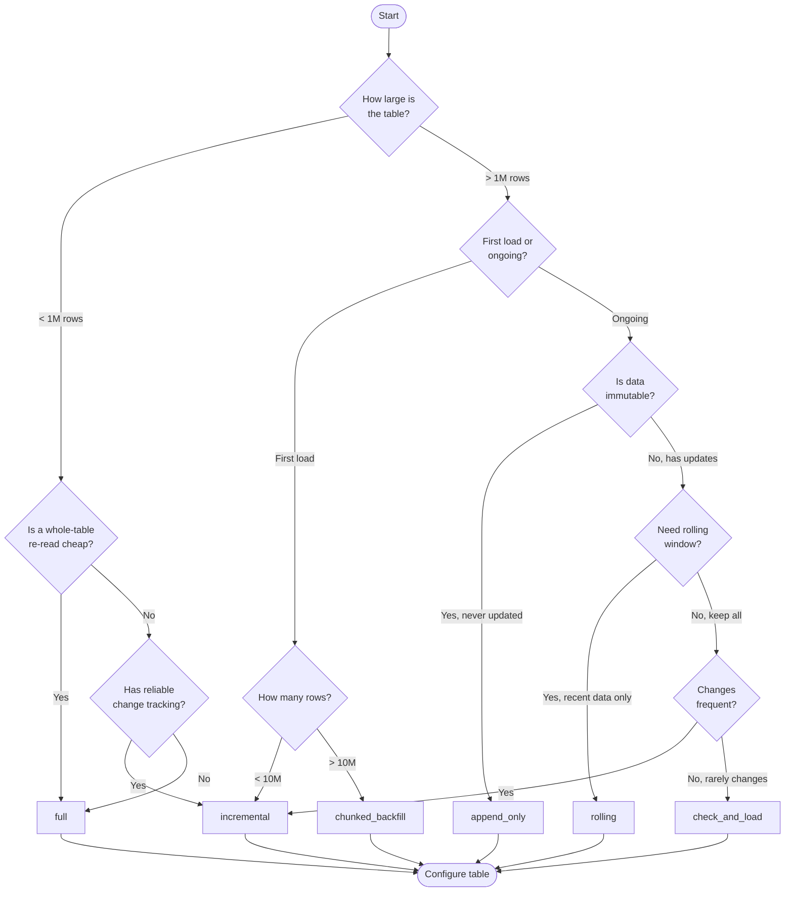

# Load Strategies Guide

DataLoader supports 6 load strategies. This page describes what each one reads from the source,
what it writes to the destination, and what it records in the control row, as the code on
`dbx-data@dev` does it today.

---

## Decision Tree



Capturing deletes is no longer part of this choice. It is a per-table option (`is_delete`) that
works with incremental, append_only, rolling and check_and_load. See
[Deletes](#deletes-is_delete-and-delete_mode).

---

## Strategy Comparison

| Strategy | Use case | Source read | Destination write | Cursor recorded | `is_delete` supported |
|---|---|---|---|---|---|
| `full` | Small tables, no tracking | Whole table | Overwrite (one commit) | None | No |
| `incremental` | Large tables with a change column | Rows above the cursor, minus a lookback | Delta MERGE via a stage table | MAX over the stage table | Yes |
| `append_only` | Immutable event data | Rows strictly above the cursor | Append | MAX over the destination above the old cursor | Yes |
| `rolling` | Time-windowed data | Last N days | Delta MERGE with an in-window delete | None | Yes |
| `check_and_load` | Rarely changing tables | COUNT first, then the whole table | Overwrite, or nothing at all | MAX over the destination | Yes |
| `chunked_backfill` | Large initial loads | Whole table, one chunk at a time | Overwrite the first chunk, append the rest | Progress after every chunk | No |

---

## Cursors, Windows and Lookback

Everything in this section applies to `incremental`, `append_only` and `rolling`, which the code
calls the windowed strategies.

### Where the cursor comes from

`incremental_value` in the control row is the high-water mark. A missing value defaults to
`1900-01-01` for a timestamp cursor and `0` for an integer one, so the first run reads everything.

After a load the new cursor is a MAX, and which table that MAX is taken over matters:

| Situation | MAX taken over |
|---|---|
| incremental merge | The stage table, so only the rows this run loaded |
| append_only | The destination, restricted to rows above the old cursor |
| First load or forced full reload | The whole destination |
| check_and_load | The whole destination |
| rolling | Nothing. Rolling has no cursor, its window comes from the clock |

The incremental merge reads the stage rather than the destination for two reasons: it is cheap, and
a stale future-dated row already sitting in the destination cannot set the mark. Delta data skipping
keeps the append_only query cheap because it is bounded below by the old cursor.

An empty window writes nothing and records nothing. The stage table is dropped and the cursor stays
where it was.

### Lookback

A row committed on the source a second before the run started, with a timestamp a second before
that, is invisible to a predicate of `> cursor`. Each incremental run therefore re-reads a window
below its cursor.

| Setting | Default | Meaning |
|---|---|---|
| `incremental_lookback_hours` (per table) | NULL | Hours re-read below the cursor |
| `DATALOADER_INCREMENTAL_LOOKBACK_HOURS` | 12 | Loader default when the table has none |

The re-read rows are absorbed by the merge, which matches them on the primary key and updates in
place. `append_only` gets zero lookback, always: an append has no key to match on, so a re-read row
would be written twice. That is why append_only needs a source that never backdates.

### Cursor capping

One row stamped in the year 2087 would otherwise become the high-water mark and skip everything
between now and then. At the start of each load the loader records the wall clock in the source's
clock (`America/Denver`). A timestamp cursor above that moment plus a margin is replaced by the
moment itself, and the substitution is logged as a warning. The margin is
`DATALOADER_CURSOR_CAP_MARGIN_HOURS`, default 1 hour. Integer cursors pass through uncapped.

### Parallel window reads

A window is not always small. The first run after an outage, or after a backfill hand-over, can be
days of changes, and reading that over one JDBC connection into one Spark partition was the usual
way a worker ran out of memory. When the row has a `partition_column` and `num_partitions` of 2 or
more, and the source speaks JDBC, the loader probes the window's own MIN and MAX of the partition
column and reads the window through Spark's partitioned JDBC options. An empty window, a window
holding a single partition value, or a Snowflake or Iceberg source stays on one connection.

Partition bounds are self-healing. On a partitioned read with `lower_bound` or `upper_bound` NULL,
the loader queries MIN and MAX from the source once, uses them, and writes them back to the control
row so dl-app shows what was used. The write-back only fills NULLs, it never overwrites bounds
someone set.

### Dialect notes

- SQL Server `rowversion` cursors are stored as BIGINT in the control row, and the predicate casts
  the column with `CAST([col] AS BIGINT)` so the comparison is numeric on both sides.
- The Oracle timestamp predicate compares the bare column against `TO_TIMESTAMP(...)`. It used to
  CAST the column, which defeated any index on it (a full scan every run) and dropped sub-second
  precision.
- Timestamp literals are floored to the whole second. Every dialect accepts the form, and flooring
  only moves a lower bound earlier, so nothing is skipped.

---

## Strategy Details

### 1. full

**When to Use**:
- Small dimension tables (< 1M rows)
- Tables without reliable change tracking
- Tables where a whole re-read costs less than maintaining a cursor

**How It Works**:
1. Read the whole source table
2. Write it with `mode("overwrite").option("overwriteSchema", "true")`

There is no truncate step. The write is a single Delta commit that replaces the table contents and
its schema, so readers see the old table until the commit lands and never see an empty one.

**Required Fields**: none beyond source and destination. `primary_key_cols` is optional and
recommended.

**SQL Pattern**:
```sql
SELECT * FROM source_table
```

**Write Mode**: `overwrite`

**Pros**:
- Simple and reliable
- No cursor to go wrong, no drift to reconcile

**Cons**:
- Inefficient for large tables
- Higher source database load
- `is_delete` does not apply, because the overwrite already drops rows the source no longer has

**Example Use Cases**:
- Employee directory
- Product catalog
- Reference and lookup tables

**Configuration**:
```sql
INSERT INTO control.table_control (
    source_table_schema, source_table_name,
    destination_table_catalog, destination_table_schema, destination_table_name,
    load_strategy, load_cron, is_active
) VALUES (
    'dbo', 'employees',
    'bronze', 'hr', 'employees',
    'full', '0 2 * * *', true
);
```

---

### 2. incremental

**When to Use**:
- Large fact tables with a timestamp or ascending ID
- Tables with a reliable `modified_date` or rowversion
- Anywhere deltas beat a whole re-read

**How It Works**:
1. Read `incremental_value` from the control row
2. Subtract the lookback (12h by default) for a timestamp cursor
3. Filter the source: `WHERE column > cursor`
4. Write the result to a stage table (`<destination>_stage`)
5. MERGE the stage into the destination on the primary key
6. Record the new cursor as MAX over the stage, capped at the run start
7. Drop the stage table

An empty stage short-circuits: no merge, no cursor update, stage dropped.

**Required Fields**:
- `incremental_column`, `incremental_type` (`timestamp` or `integer`)
- `primary_key_cols`
- All four partition fields: `partition_column`, `num_partitions`, `lower_bound`, `upper_bound`

**SQL Pattern**:
```sql
-- PostgreSQL
SELECT * FROM source_table
WHERE modified_date > ('2024-01-15 10:30:00'::timestamp + INTERVAL '1 second')

-- SQL Server
SELECT * FROM source_table
WHERE modified_date > CAST('2024-01-15 10:30:00' AS DATETIME2)

-- Oracle
SELECT * FROM source_table
WHERE modified_date > TO_TIMESTAMP('2024-01-15 10:30:00', 'YYYY-MM-DD HH24:MI:SS')
```

**Write Mode**: Delta MERGE (upsert) through a stage table

**Pros**:
- Efficient for large tables
- Low source database impact
- The merge absorbs re-read rows, which is what makes the lookback safe

**Cons**:
- Needs a change column the source actually maintains
- A business date is a bad cursor: it is set by the business event, not by the write, so a
  backdated insert lands below the mark and is never read

**Example Use Cases**:
- Sales orders (millions of rows)
- Customer transactions
- IoT sensor data

**Configuration**:
```sql
INSERT INTO control.table_control (
    source_table_schema, source_table_name,
    destination_table_catalog, destination_table_schema, destination_table_name,
    load_strategy, incremental_column, incremental_type, incremental_value,
    primary_key_cols, partition_column, num_partitions, lower_bound, upper_bound,
    load_cron, is_active
) VALUES (
    'dbo', 'orders',
    'bronze', 'sales', 'orders',
    'incremental', 'modified_date', 'timestamp', '2024-01-01 00:00:00',
    'order_id', 'order_id', 10, '1', '90000000',
    '0 */4 * * *', true
);
```

---

### 3. append_only

**When to Use**:
- Immutable data, never updated and never backdated
- Log tables, audit trails, sensor readings

**How It Works**:
1. Read `incremental_value` from the control row
2. Filter the source: `WHERE column > cursor`, with no lookback
3. Append to the destination, no merge and no deduplication
4. Record the new cursor as MAX over the destination above the old cursor

Zero appended rows means no cursor update.

**Required Fields**:
- `incremental_column`, `incremental_type`
- `primary_key_cols` (dl-app requires it; the append itself does not use it, the delete
  reconciliation and any later switch to incremental do)
- All four partition fields

**SQL Pattern**: same as incremental, without the lookback subtraction

**Write Mode**: `append` with `mergeSchema`

**Pros**:
- The cheapest write the loader has
- Predictable: what is read is what is written

**Cons**:
- Cannot handle updates
- A re-read row is a duplicate row, which is why the lookback is zero
- Any gap in the source's clock ordering loses rows for good

**Example Use Cases**:
- Application logs
- Clickstream events
- Sensor readings
- Audit trails

**Configuration**:
```sql
INSERT INTO control.table_control (
    source_table_schema, source_table_name,
    destination_table_catalog, destination_table_schema, destination_table_name,
    load_strategy, incremental_column, incremental_type, incremental_value,
    primary_key_cols, partition_column, num_partitions, lower_bound, upper_bound,
    load_cron, is_active
) VALUES (
    'dbo', 'audit_log',
    'bronze', 'audit', 'application_events',
    'append_only', 'event_timestamp', 'timestamp', '2024-01-01 00:00:00',
    'event_id', 'event_id', 10, '1', '500000000',
    '*/15 * * * *', true
);
```

---

### 4. rolling

**When to Use**:
- Time-series data where only a recent window is worth maintaining
- Dashboards over the last N days

**How It Works**:
1. Compute the cutoff: today in `America/Denver`, minus `rolling_days` (90 when NULL)
2. Filter the source: `WHERE column >= cutoff`
3. Write the result to a stage table
4. MERGE into the destination with three clauses: update matched, insert not matched, and delete
   not-matched-by-source **inside the window**

The delete clause carries a condition:

```sql
target.<rolling_column> >= (DATE('<today>') - INTERVAL '<rolling_days>' DAY)
```

Rows older than the window are not matched by the source, and the condition still excludes them, so
they are left alone. Rolling maintains the window, it does not prune what predates it. Anything
already loaded below the cutoff stays until someone removes it deliberately.

An empty source window short-circuits before the merge. This is not an optimization: an empty window
says nothing about the destination, and running the not-matched-by-source delete against an empty
stage would empty the whole window.

**Required Fields**:
- `rolling_column`, `rolling_days`
- `primary_key_cols`
- All four partition fields

**SQL Pattern**:
```sql
-- PostgreSQL
SELECT * FROM source_table
WHERE event_date >= '2024-03-01'::date - INTERVAL '30 days'

-- SQL Server
SELECT * FROM source_table
WHERE event_date >= DATEADD(day, -30, CAST('2024-03-01' AS DATE))

-- Oracle
SELECT * FROM source_table
WHERE event_date >= TO_DATE('2024-03-01', 'YYYY-MM-DD') - 30
```

**Write Mode**: Delta MERGE with an in-window `whenNotMatchedBySourceDelete`

**Pros**:
- Bounded source read regardless of table size
- Deletes inside the window are picked up by the merge itself, without `is_delete`
- No cursor to maintain or repair

**Cons**:
- Re-reads the whole window every run
- Rows that leave the window stop being maintained, so the destination holds whatever they last
  looked like

**Example Use Cases**:
- Last 7 days of website traffic
- Last 30 days of system metrics
- Last 90 days of customer interactions

**Configuration**:
```sql
INSERT INTO control.table_control (
    source_table_schema, source_table_name,
    destination_table_catalog, destination_table_schema, destination_table_name,
    load_strategy, rolling_column, rolling_days,
    primary_key_cols, partition_column, num_partitions, lower_bound, upper_bound,
    load_cron, is_active
) VALUES (
    'dbo', 'page_views',
    'bronze', 'analytics', 'recent_page_views',
    'rolling', 'view_timestamp', 30,
    'view_id', 'view_id', 10, '1', '250000000',
    '0 */6 * * *', true
);
```

---

### 5. check_and_load

**When to Use**:
- Tables that change rarely, and change in many places when they do
- Tables where a delta merge is not worth the machinery

**How It Works**:
1. Run one `COUNT(*)` of rows above the cursor
2. Count is zero: write nothing. The loader returns an empty frame with no schema, the write is
   skipped entirely and the cursor is untouched
3. Count is non-zero: read the **whole** table and overwrite the destination

There is no incremental MERGE here. The count is a gate, not a filter. The cursor afterwards is MAX
over the whole destination, which is correct because the destination now holds the whole source.

The design suits its use case: a table that changes a few times a month is cheaper to replace than
to merge, and replacing it picks up updates and deletes without any delete bookkeeping. It is a poor
fit for anything large, because the day it does change it reads everything.

**Required Fields**:
- `incremental_column`, `incremental_type`
- `primary_key_cols`
- Partition fields are optional. check_and_load never uses Spark's partitioned JDBC read.

**SQL Pattern**:
```sql
-- First: how many rows changed
SELECT COUNT(*) AS update_count FROM source_table
WHERE modified_date > '2024-01-15 10:30:00'

-- If the count is above zero: read everything, overwrite the destination
SELECT * FROM source_table
```

**Write Mode**: `overwrite`, or no write at all

**Pros**:
- A no-change run costs one COUNT
- An overwrite picks up updates and deletes with no merge and no delete flags

**Cons**:
- A changed run reads the whole table, however small the change was
- The count query itself scans unless the change column is indexed

**Example Use Cases**:
- Configuration tables
- Master data with infrequent changes
- Reference data updated weekly

**Configuration**:
```sql
INSERT INTO control.table_control (
    source_table_schema, source_table_name,
    destination_table_catalog, destination_table_schema, destination_table_name,
    load_strategy, incremental_column, incremental_type,
    primary_key_cols, load_cron, is_active
) VALUES (
    'dbo', 'product_categories',
    'bronze', 'products', 'categories',
    'check_and_load', 'last_updated', 'timestamp',
    'category_id', '0 6 * * *', true
);
```

---

### 6. chunked_backfill

**When to Use**:
- Large initial loads, tens of millions of rows and up
- Tables too large to land in one write

**How It Works**:
1. Read the control row. A Lakebase failure here raises rather than starting over: restarting a
   backfill that already loaded hours of chunks is worse than failing loudly
2. Read the source MIN and MAX, and pick the chunk column
3. Plan the resume
4. Size the chunks from the catalog's row estimate
5. Calculate chunk boundaries
6. For each chunk in order: build the range query, read it over parallel JDBC connections, write it,
   then record progress in the control row
7. Compare destination rows against the source estimate as a sanity check
8. Hand the row over to `incremental`

**Chunk column: key mode vs timestamp mode**

| Mode | Chosen when | Chunks cut on | Progress kept in |
|---|---|---|---|
| Key | `partition_column` is set, differs from `incremental_column`, and is numeric on the source | The numeric key | `backfill_cursor` |
| Timestamp | Anything else | `incremental_column` | `incremental_value` |

Key mode is preferred because each chunk then filters an indexed key range instead of scanning for a
window of a usually unindexed timestamp. It keeps its mark in `backfill_cursor` so
`incremental_value` can stay a timestamp for the strategy that takes over.

**Chunk sizing** (`dbx/functions/partitioning.py`):

| Constant | Value | Env override |
|---|---|---|
| `ROWS_PER_CHUNK` | 50,000,000 | `DATALOADER_ROWS_PER_CHUNK` |
| `MIN_CHUNKS` | 10 | none |
| `MAX_CHUNKS` | 1000 | none |

Key mode: `ceil(rows / ROWS_PER_CHUNK)`, clamped between MIN and MAX, where rows is the catalog's row
estimate or, without one, the key range treated as dense. Timestamp mode: 30 days per chunk, raised
to at least `ceil(rows / ROWS_PER_CHUNK)` when an estimate exists, because equal time slices hide the
fact that a busy table's recent months hold most of its rows. `num_partitions` on the row is never
consulted for chunk sizing: it belongs to the incremental strategy and is carried over at hand-over.
A chunk that carried more than twice `ROWS_PER_CHUNK` rows logs a warning naming the fix.

**Parallelism**: chunks run one after another, but each chunk is read over parallel JDBC connections,
two per cluster core, between 8 and 64, or `DATALOADER_CHUNK_JDBC_PARTITIONS`. In key mode the
chunk's own bounds are the partition bounds, so there is no extra MIN/MAX round trip. Chunk reads use
a JDBC fetch size of 100,000 rows, or 20,000 on Oracle, whose driver preallocates prefetch buffers
per row.

**Progress and resume** (`dbx/functions/backfill.py`):
- Chunks cover `[start, end)`, so every row a completed chunk wrote sits below the recorded mark
- The mark is written after **every** chunk, not at the end. A canceled run kills the job with no
  handler, so the mark on disk is the only resume point there is
- Resuming deletes destination rows at or above the mark first. They can only come from a chunk that
  appended and never got to record itself
- No destination table means the mark is ignored and the backfill starts fresh
- Only a fresh start overwrites. The first chunk of a resumed run appends
- A mark at or past the source MAX means there is nothing left to do, and the row hands over

**Hand-over**: when the last chunk lands, the control row is updated in one statement to
`load_strategy = 'incremental'`, `incremental_value = <hand-over cursor>` and
`backfill_cursor = NULL`. In key mode the key's MIN and MAX are also written as `lower_bound` and
`upper_bound`, with `num_partitions` defaulted to 10 if the row has none, because the incremental
strategy needs those for its first full reload. A `table_control_history` row is written with
`change_source = 'backfill_complete'` so the switch shows in dl-app. When the chunks were cut on the
incremental column no JDBC bounds are known, and the loader warns that they must be set before a
forced full reload.

**The hand-over cursor**:

| Case | Cursor |
|---|---|
| Timestamp, fresh run | The wall clock at the start of the backfill in `America/Denver`, minus 24h (`DATALOADER_BACKFILL_CURSOR_MARGIN_HOURS`) |
| Timestamp, resumed run | The cursor the original start recorded, kept as is |
| Integer, key is the incremental column | MAX of the key |
| Integer, otherwise | MAX of the incremental column, queried from the source |

The start time is as valid a cursor as `MAX(incremental_column)`, since nothing in the source was
newer at that moment, and it costs nothing where that MAX was a full scan. The margin covers clock
skew, and the first incremental run re-reads it and merges it on the primary key. MAX of the
destination at the end would be wrong: a row read in an early chunk and updated before the last chunk
was read can sit below that MAX, and its update would never be loaded. A resumed run keeps the
original cursor so updates made while it was stopped are not skipped.

**Row parity**: at the end the destination's `COUNT(*)` (answered from Delta statistics) is compared
against the source's catalog estimate. More than 5% apart logs a warning. Equal counts do not prove
the rows are current, that is what the hand-over cursor is for, but a large gap means chunks were
lost.

**Required Fields**:
- `incremental_column`, `incremental_type`
- `partition_column`, used for the parallel reads inside each chunk
- `primary_key_cols` is optional for the backfill, and needed by the incremental strategy after
  hand-over
- `num_partitions`, `lower_bound` and `upper_bound` are unused by the backfill and only carried over

**Pros**:
- Handles billions of rows
- Resumable at chunk granularity
- Hands itself over, so onboarding a large table is one config row

**Cons**:
- `is_delete` does not apply
- Chunks are sequential, so a slow source dictates the total time
- The dev row limit does not apply, so a backfill pointed at a dev catalog loads everything

**Example Use Cases**:
- Historical data migration
- Initial table onboarding
- Large fact table backfills

**Configuration**:
```sql
INSERT INTO control.table_control (
    source_table_schema, source_table_name,
    destination_table_catalog, destination_table_schema, destination_table_name,
    load_strategy, incremental_column, incremental_type,
    partition_column, primary_key_cols, load_cron, is_active
) VALUES (
    'dbo', 'transactions_historical',
    'bronze', 'finance', 'transactions',
    'chunked_backfill', 'modified_date', 'timestamp',
    'transaction_id', 'transaction_id', '0 2 * * *', true
);

-- At completion the loader sets:
--   load_strategy     = 'incremental'
--   incremental_value = <hand-over cursor>
--   backfill_cursor   = NULL
--   lower_bound / upper_bound / num_partitions (key mode only)
```

---

## Deletes: `is_delete` and `delete_mode`

A row that disappears from the source is invisible to every strategy that filters on a cursor or a
window. `is_delete` turns on a reconciliation pass after the load: pull the source's primary keys,
anti-join them against the destination's, and act on what is left over.

| Setting | Values | Meaning |
|---|---|---|
| `is_delete` | boolean | Run the reconciliation after each load |
| `delete_mode` | `soft` (default), `hard` | What happens to a row that is gone |

**Soft** sets `is_delete = true` and `deleted_at = current_timestamp()` and keeps the row.
`deleted_at` is only written for rows not already flagged, so it records when the row was first seen
missing and works as an effective date. A row that comes back in the source is restored:
`is_delete = false`, `deleted_at = NULL`.

**Hard** removes the row from the destination Delta table. There are no bookkeeping columns and no
restore step, because there is nothing left to restore.

Anything missing or unrecognised resolves to `soft`, and the bad value is logged. The fallback goes
in the safe direction deliberately: a typo in `delete_mode` must never escalate into deleting rows.

**Where it applies**: incremental, append_only, rolling and check_and_load. It is skipped with a log
line for full and chunked_backfill, which replace or build the destination anyway. It is also skipped
when `primary_key_cols` is empty, since there is nothing to join on.

**Zero-rows guard**: if the source key query returns zero rows while the destination still holds
rows, the pass is skipped with a warning. A failed, filtered or empty source pull would otherwise
flag or delete the entire table.

**Bookkeeping columns on demand**: `is_delete BOOLEAN` and `deleted_at TIMESTAMP` are added to the
destination when soft mode needs them and they are missing, so turning delete tracking on does not
require rebuilding the table. The incremental merge populates them on insert (`is_delete = false`,
`deleted_at = NULL`), because new rows arrive live, never pre-deleted.

**Throttling**: reconciliation pulls every source key and scans the destination, which on a large
table costs more than the incremental load it follows. `deletes_checked_at` on the control row
records when it last ran, and `DATALOADER_DELETE_CHECK_HOURS` (default 24) is the interval. Set the
interval to 0 to run it every load. The stamp is only written when the pass actually completed.

The source keys themselves are read over parallel JDBC connections when the first primary key column
is numeric, and over one connection otherwise.

---

## Forced Full Reload (`load_full`)

`load_full` on the control row forces one whole-source reload. It is a batch-level setting: the
sensor groups tables by it, the loader is constructed with `full_load` for the whole batch, and
Dagster resets the flag to false once the table succeeds.

A forced reload **bypasses the strategy's window entirely**. Incremental, append_only and rolling
read the whole source, not their window. The reason is the write side: a full load overwrites the
destination, so a windowed read would leave the table holding only that slice. The loader logs the
bypass when it happens.

With a `partition_column` set, a forced reload is a partitioned JDBC read. Without one it is a single
connection over the whole table, which is the practical reason the form requires the partition
fields.

---

## Delta Table Tuning

Every destination table is brought up to a standard tuning, once per table per run, from
`DESCRIBE DETAIL`.

| Property | Value | Why |
|---|---|---|
| `delta.enableDeletionVectors` | true | Merges and deletes rewrite less |
| `delta.autoOptimize.optimizeWrite` | true | Frequent small merges stop producing small files |
| `delta.autoOptimize.autoCompact` | true | Chunk appends and merge output get compacted |

Properties are only set when missing or different. Liquid clustering on `primary_key_cols` is added
for `incremental` and `rolling` only, the two strategies that merge on that key, so a merge prunes
files instead of touching all of them. It is applied only to a table with no clustering yet: a table
someone clustered deliberately is left alone. Existing data is not reclustered here, OPTIMIZE does
that.

`DATALOADER_TABLE_TUNING=off` (or `0`, or `false`) disables the whole step.

---

## Dev Row Limit

Loads targeting a catalog whose name contains `dev` are capped at 1000 rows, using the source's own
syntax (`TOP`, `ROWNUM`, `LIMIT`). `dev_full_load` on the control row overrides the cap for that
table.

The cap is applied where the loader builds a query: full, incremental, append_only, rolling and
Iceberg reads. It is not applied to the partitioned first-load and forced-reload path, to
check_and_load's whole-table re-read, or to chunked_backfill chunks.

---

## Required Fields Summary

Taken from `dl-app/models.py`, which is what the form and the API validate against.

| Strategy | incremental_column | incremental_type | primary_key_cols | rolling_column | rolling_days | partition_column | num_partitions | lower_bound | upper_bound |
|---|---|---|---|---|---|---|---|---|---|
| full | - | - | optional | - | - | - | - | - | - |
| incremental | Required | Required | Required | - | - | Required | Required | Required | Required |
| append_only | Required | Required | Required | - | - | Required | Required | Required | Required |
| rolling | - | - | Required | Required | Required | Required | Required | Required | Required |
| check_and_load | Required | Required | Required | - | - | optional | optional | optional | optional |
| chunked_backfill | Required | Required | optional | - | - | Required | unused | unused | unused |

Why incremental, append_only and rolling need all four partition fields, even though their ongoing
runs ignore them: their first load (destination table missing) and every forced full reload go
through Spark's partitioned JDBC read, which needs `partitionColumn`, `lowerBound`, `upperBound` and
`numPartitions`. A row without them cannot be loaded the first time. The loader is more forgiving
than the form, filling missing bounds from the source and falling back to 10 partitions, but the
validation is what stops a row being created that cannot run.

`num_partitions` defaults to 10, not 12. dl-app suggests a count aiming at 500,000 rows per
partition, never below 10 and never above 32.

chunked_backfill needs only `partition_column`, which its parallel reads inside each chunk use with
per-chunk bounds. check_and_load never partitions, so everything there is optional.

---

## Known Gaps

**The source MAX row is not read by a chunked backfill.** `calculate_chunk_boundaries` ends the last
chunk exactly at `max_val`, while `build_chunk_query` filters `>= chunk_start AND < chunk_end` in
every dialect. The row sitting at the source MAX of the chunk column therefore falls outside every
chunk. Whether it matters depends on what happens next:

- Timestamp chunks handing over to an incremental cursor with a lookback: the first incremental run
  reads from `cursor - 12h`, which covers it.
- Key mode: the hand-over cursor is a timestamp taken at the start of the backfill, so a row whose
  incremental timestamp is above it is picked up by the first incremental run.
- An integer `incremental_type` handing over with `incremental_value = MAX`: the first incremental
  run filters `> MAX` and never reads it. That row stays missing until a forced full reload.

The row parity check does not catch it, since it warns at a 5% gap. Open question for the team:
should the last chunk close inclusively, or should the final boundary be nudged past `max_val`?

---

## Related Documentation

- [System Overview](01-system-overview.md), Architecture context
- [Lakebase Control Database](02-lakebase-control-database.md), The control row and its columns
- [DataLoader Class](04-dataloader-class.md), Implementation details
- [Sequence Diagrams](../diagrams/03-sequence-diagrams.md), Visual flows
- [Troubleshooting](06-troubleshooting.md), Debugging strategies
