# Control Manager UI (dl-app)

The web app for running DataLoader. Configure source databases and tables, watch loads, crawl a
source's catalog, promote configuration to production, and manage the secrets behind it.

> Screenshots are captured from a live instance by `scripts/docshots.py`. The source databases and
> tables in them are examples.

---

## How it runs

The app runs as a Databricks App, deployed from the workspace repo by the app deploy pipeline.

| | |
|---|---|
| URL | The `dl-app` Databricks App in each workspace. Get the current address from the Databricks Apps list |
| Server | gunicorn, 4 workers |
| Deployed by | `databricks apps deploy dl-app` from the workspace repo checkout |
| Secrets | App resources bound to the Key Vault backed scope, referenced by `valueFrom` in `app.yaml` |
| Identity | The `X-Forwarded-Email` header set by the Databricks proxy |
| Databases | Two Lakebase pools, test by default, prod created on demand by the header switch |

### Cluster-backed buttons

Five buttons do real work against a source database by submitting a one-off notebook run on the
dataloader cluster, then polling it.

| Button | Where | What it does |
|---|---|---|
| Test connection | Database config form | Connects with the configured secrets and reports which resolved |
| Crawl source catalog | Table list | Caches every source table's columns, keys, indexes and row estimate |
| Suggest columns | Table form | Reads the source table's columns and ranks them for Incremental and Partition |
| Get partition values | Table form | Reads MIN, MAX and COUNT of the partition column and fills the bounds |
| Preview rows | Table form, source catalog | Reads the first ten rows |

All five need the deployment principal's credentials and the cluster id, and all five are
**disabled on PROD**. The app shows the reason rather than hiding the button silently. A cold
cluster start is the whole wait; the status line says so.

---

## Global chrome

Present on every page.

| Control | Behavior |
|---|---|
| Nav | Dataloader (home), Operations, Runs, Trends, Audit History, Key Vault |
| Find a table, or **Ctrl+K** | Quick open. Enter opens the table's runs and health hub, Shift+Enter opens its configuration |
| Theme toggle | Light and dark, remembered per browser |
| TEST / PROD | Switches which Lakebase database the app reads and writes |
| Timezone badge | Times are shown in `America/Denver` and stored as UTC |

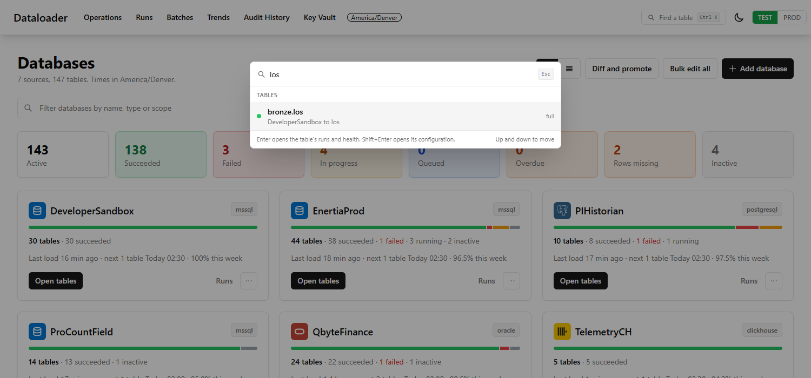

---

## Databases

The landing page. Every source database, how it is doing, and what runs next.

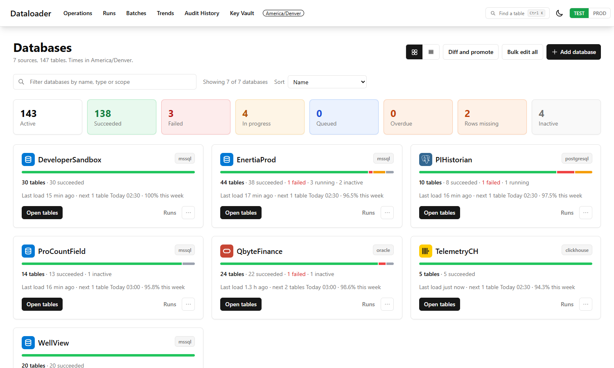

Counters across the top are clickable and lead to the matching status view: Active, Succeeded,
Failed, In progress, Queued, Overdue, Inactive.

Each card carries the database type, a health bar, table counts, when it last loaded, what is due
next, and the week's success rate. Buttons: **Open tables**, **Runs**, and a row menu with Edit
connection, Bulk edit tables, Run all now, and Delete.

Header buttons: card or list view, **Diff and promote**, **Bulk edit all**, **Add database**. When
a configuration exists that no table references, a **Remove orphaned configs** button appears.

---

## Operations

The page to open when something looks wrong. It answers four questions: is anything broken, did the
last window finish, what runs next, and is anything late.

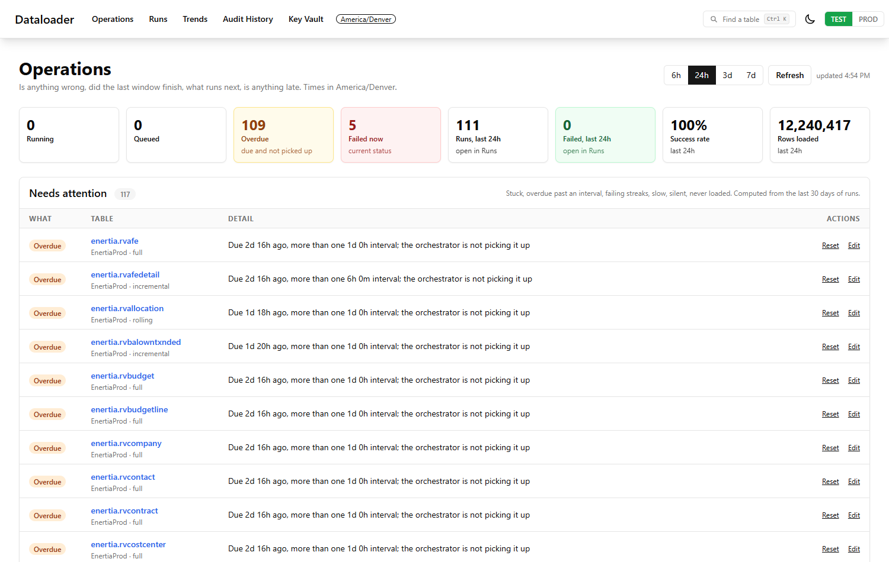

- **Window tabs** 6h, 24h, 3d, 7d, plus Refresh and a last-updated stamp.
- **Health strip**: running, queued, overdue, failing now, runs in the window, failures in the
  window, success rate, rows loaded.
- **Needs attention**: tables that are stuck, overdue past a whole interval, on a failing streak,
  slow, silent, or never loaded. Computed from 30 days of runs. Each row has Reset and Edit.
- **Next N hours** as a timeline or a week heatmap. Bar length is the table's usual duration.
- **Last N hours**: longest runs, most rows, failures.
- **Freshness** by database.

---

## Runs

Every run in a window, filterable and exportable.

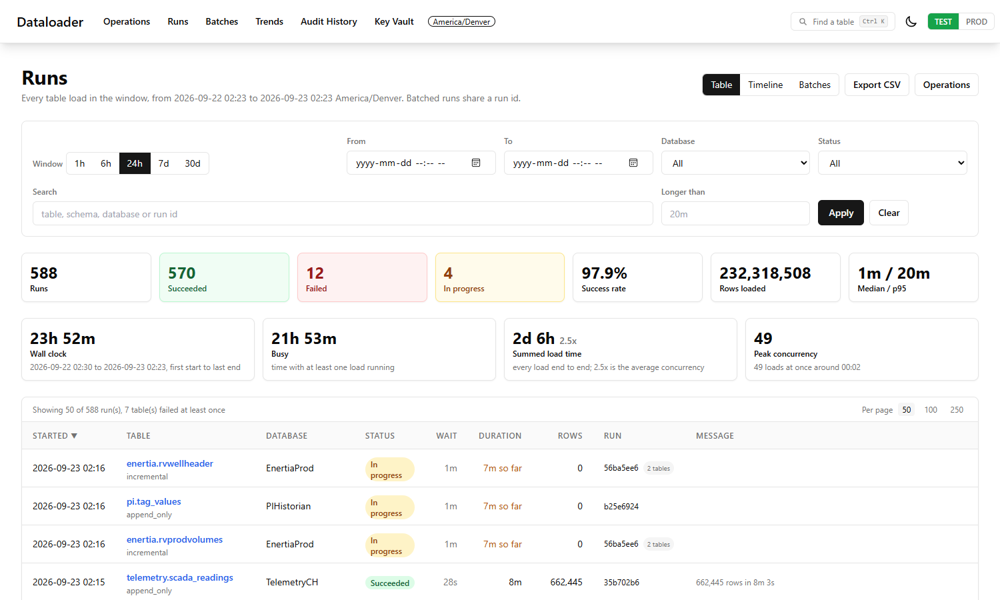

Filters: window chips, explicit from and to dates, database, status, and free text across table,
schema, database or run id. Columns sort. Rows link to the Dagster run. **Export CSV** carries the
current filters.

### Table hub

One table's whole story: state now, configuration, recent runs with sparklines, what needs
attention, and recent configuration changes. This is where Ctrl+K lands.

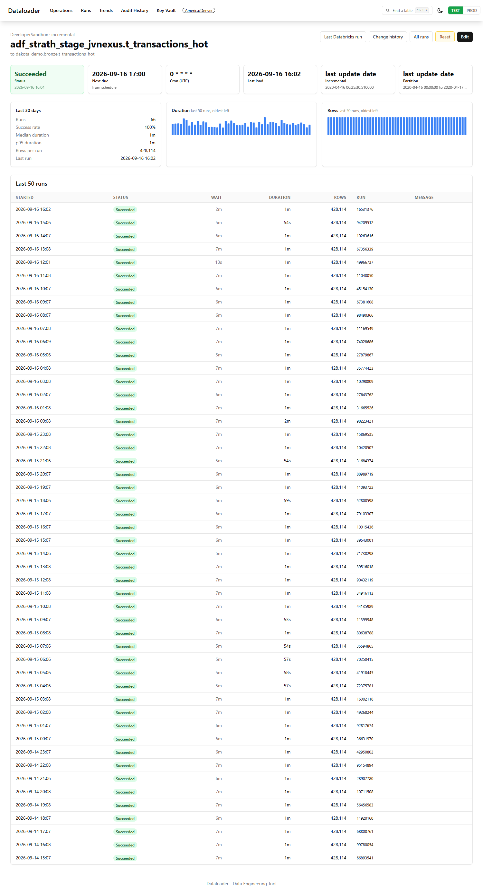

---

## Trends

Twelve weeks, one point per week: success rate, rows loaded, run duration at p50 and p95, and
failures by database. Hover any mark for the exact numbers.

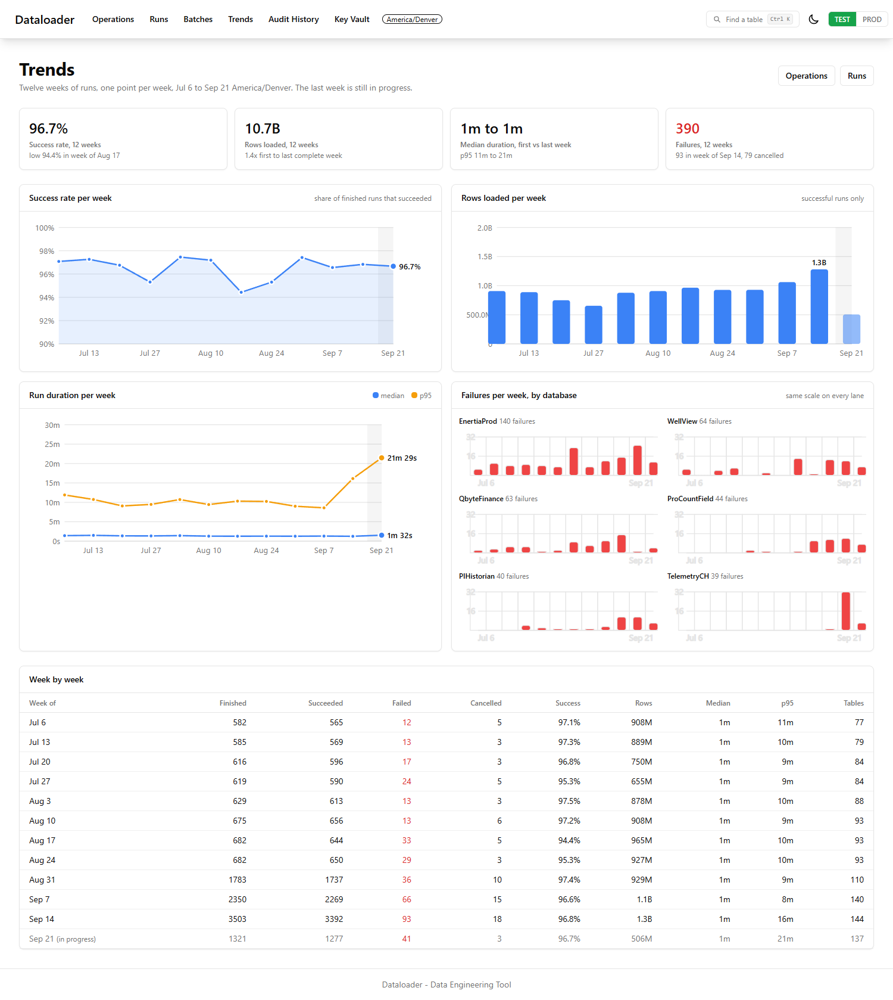

---

## Tables

### Table list

Every table for one database.

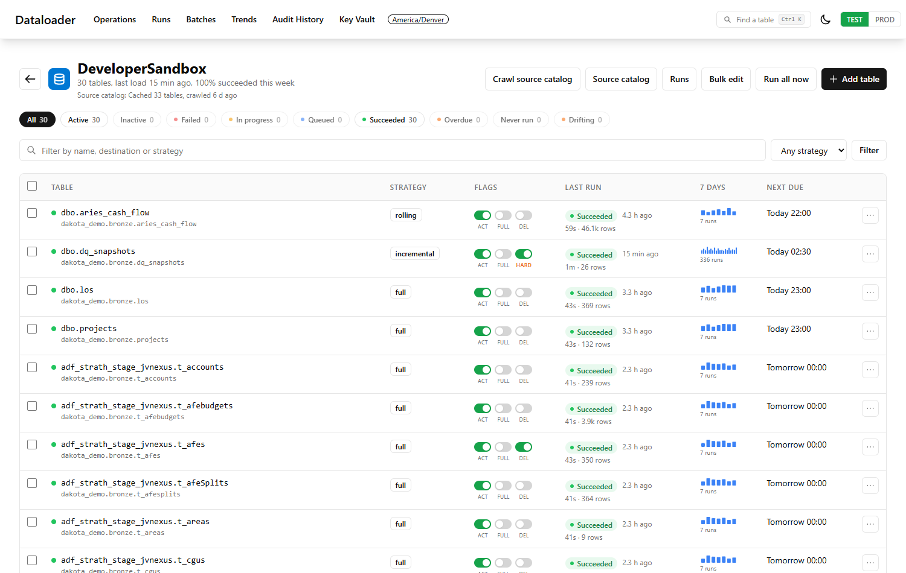

- **Filter chips with counts**: All, Active, Inactive, Failed, In progress, Queued, Succeeded,
  Overdue, Never run. Filtering to Failed adds a **Reset all failed** banner.
- **Crawl source catalog** with a live status line, and a **Source catalog** link once a cache
  exists.
- Search by name, destination or strategy, plus a strategy filter.
- Checkboxes with **select all matching** across pages, then Activate, Deactivate or Delete.
- Three toggles per row: Active, Full load, Mark deletes. The status pill opens the error.
- Row menu: Runs and health, Edit, Change history, Reset, Clone, Delete.

### Source catalog

The cached result of a crawl, with checkboxes to create table configurations in bulk.

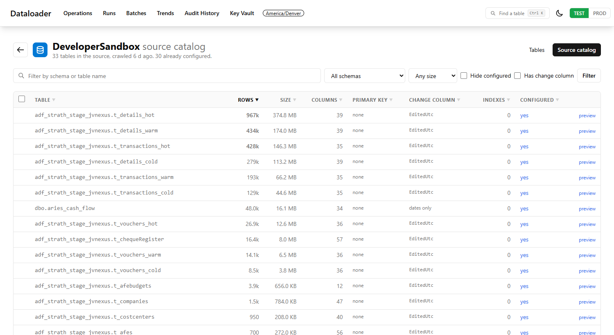

Columns sort, so you can find the biggest tables in a source by clicking Rows. Filters: schema,
minimum rows, hide already configured, and **has a change column**.

**Change column** is the crawl's best guess at an incremental cursor, ranked by what the name says:
a SQL Server rowversion first, then a modified-looking timestamp, then a created-only one. Business
dates are never suggested. Tick some rows, pick a strategy, and **Create configs** derives each
table's primary key, destination name, partition column and incremental column from the cache.

Every row has a **preview** link.

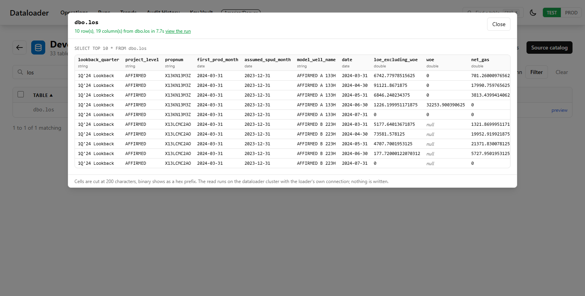

### Add and edit a table

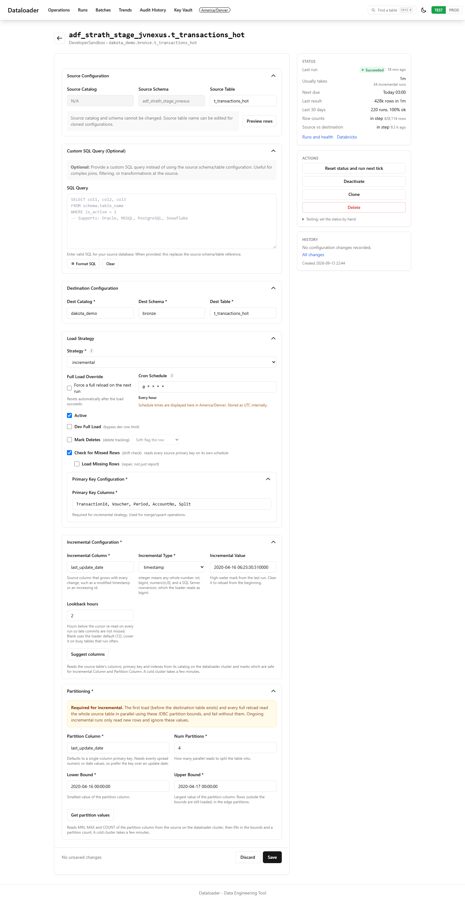

Sections: Source, Custom SQL (with Format SQL), Destination, Load Strategy, Primary Key,
Incremental Configuration, Partitioning, Advanced. Strategy-dependent fields swap in when the
strategy changes.

What the controls do:

| Control | Notes |
|---|---|
| Full Load Override | One-time forced reload; resets itself after the load succeeds |
| Mark Deletes + mode | Soft flags the row and keeps it, hard removes it. Needs a primary key |
| Dev Full Load | Bypasses the 1000 row dev catalog limit |
| Lookback hours | Hours re-read below the cursor. Blank uses the loader default of 12 |
| Cron | Shown and edited in display timezone, stored as UTC, with a live description |
| Preview rows | The first ten rows of the source, read on the cluster |

The right rail shows current state, run links, and actions: Reset status, Activate, Clone, Delete,
and a collapsed block for setting the status by hand while testing.

**Suggest columns** reads the source's columns, keys and indexes, and grades each one for use as an
incremental cursor and as a partition column, with the reason spelled out.

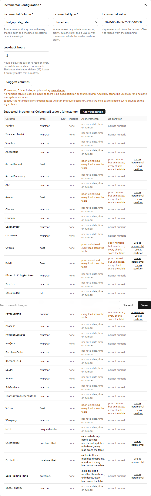

### Create a table

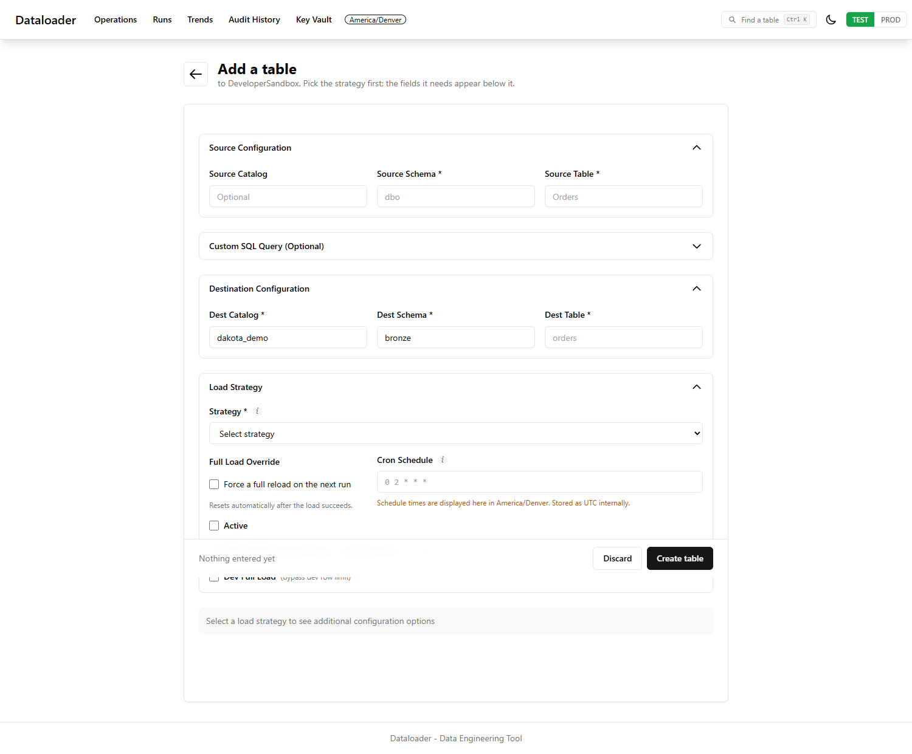

---

## Database configuration

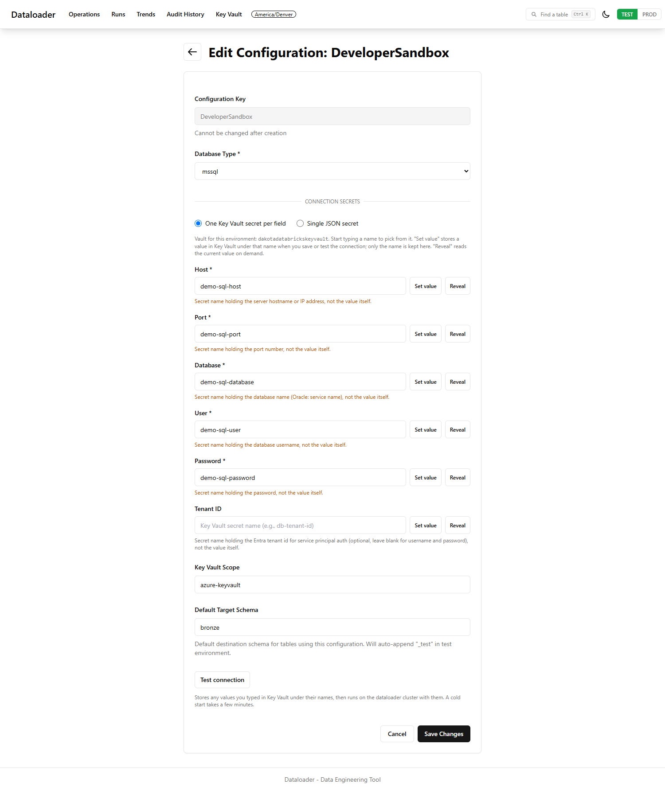

Types: `mssql`, `oracle`, `postgresql`, `snowflake`, `snowflake_pem`, `clickhouse`, `s3_iceberg`.
Changing the type swaps the fields.

Secrets are never stored in the control database. Each field holds the **name** of a Key Vault
secret. Two layouts are offered: one secret per field, or a single secret holding a JSON bundle of
all of them, with a template per database type.

Per field you can **Set value** (write the value into Key Vault on save) and **Reveal** (read the
current value on demand). **Test connection** proves it works before you save.

---

## Bulk edit

A spreadsheet over the table configurations, for changes too tedious to make one form at a time.
Paste from Excel, right-click for row actions, then Save all changes.

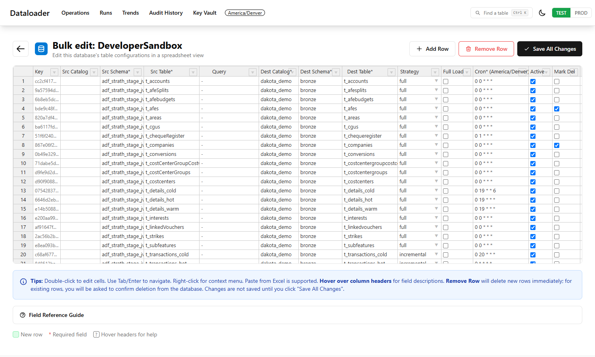

Editable columns cover the whole configuration: source and destination identity, custom query,
strategy, cron, the boolean flags including Mark deletes and delete mode, the incremental and
rolling fields, all four partitioning fields, and primary key columns. Checkbox columns accept
pasted text such as true/false, yes/no, 1/0, y/n.

Available per database, or across every database at once.

---

## Status views

One status at a time, across every database.

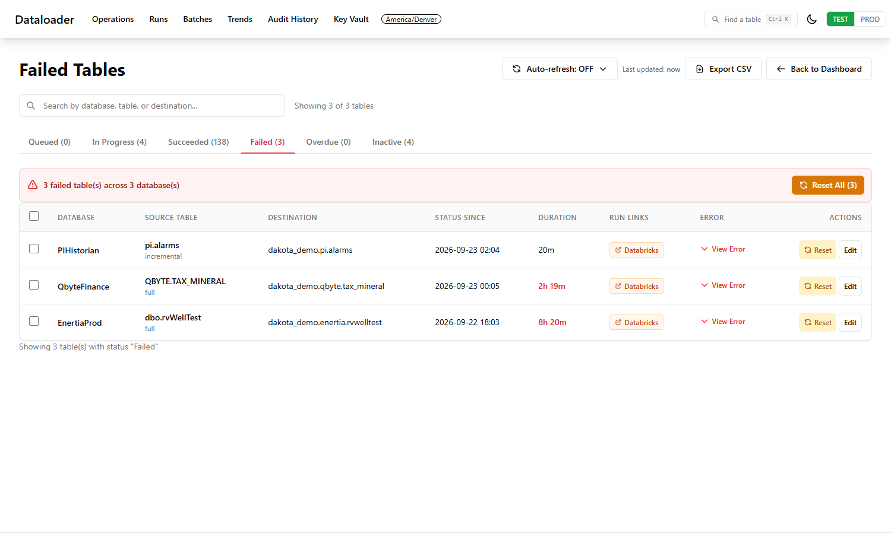

Tabs carry counts: Queued, In Progress, Succeeded, Failed, Overdue, Inactive. Each row expands to
its error, with copy to clipboard.

- **Auto-refresh** at 10s, 30s, 60s or 5m, with a countdown. Selections survive a refresh.
- **Reset selected** or **Reset all**, and on the Inactive view, Activate.
- **Export CSV**.

Resetting a table clears its status so the next sensor tick picks it up.

---

## Promote to prod

Compares test against production and moves configuration across. Nothing here touches data; it
moves rows in `table_control` and `table_control_dbconfig`.

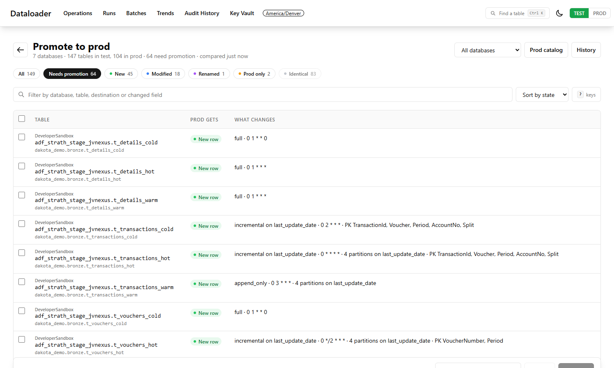

State chips: All, Needs promotion, New, Modified, Renamed, Prod only, Identical. Expand a row to see
exactly which fields differ.

**Preview** shows what would be written before anything is written: inserts, updates, renames, the
database configuration that would be copied, and a **Key Vault check** listing secrets that are
missing from the production vault, with a checkbox to copy each one across. Values are never shown.
Promote then runs in one transaction.

**Delete from prod** removes rows that exist only in production, leaving the same audit record a
manual delete would.

### Keyboard shortcuts

Press `?` on the page for this list.

| Key | Action |
|---|---|
| `[` `]` | Previous or next database |
| `j` `k` or arrows | Move the row cursor |
| `x` or space | Select the row |
| `Enter` | Expand the row's changes |
| `1`-`7` | Switch state chip |
| `/` | Focus the filter |
| `a` | Select all needing promotion |
| `c` | Clear selection |
| `p` | Preview |
| `?` | Toggle help |

---

## Key Vault explorer

Browse and manage the secrets the database configurations point at.

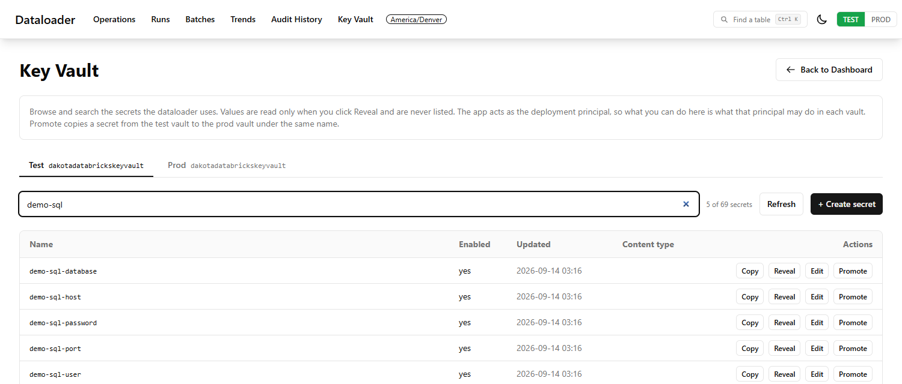

Switch between the test and prod vaults. Per secret: **Copy** the name, **Reveal** the value on
demand, **Edit** to write a new version, and **Promote** to copy it to the prod vault under the same
name. **New secret** offers a connection bundle template per database type.

Values are only ever fetched when you ask for one. The list itself carries names and metadata only.

---

## Audit history

Every configuration change across every table, with filters for date range, user, change type,
change source and database.

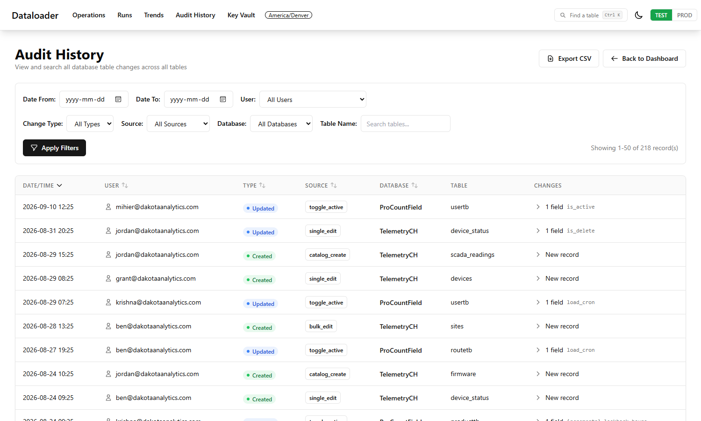

Entries expand to show old and new values. **Export CSV** carries the filters.

`change_source` says what made the change: the app, a bulk edit, a promotion, the loader itself. A
source of `backfill_complete` means a chunked backfill finished and handed the table over to the
incremental strategy.

### Per-table history

The same audit trail for one table, reachable from the table list row menu and from the edit page.

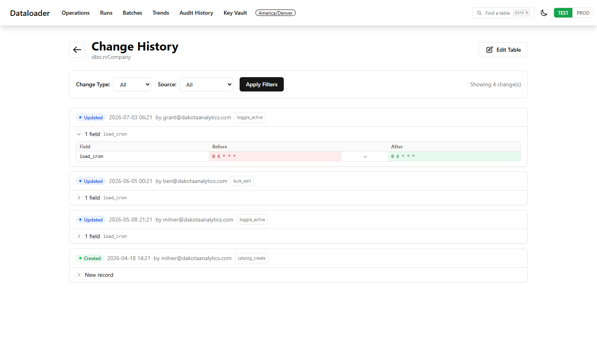

---

## Related documentation

- [Common Tasks](08-common-tasks.md), the recipes most of this UI exists to serve
- [Lakebase Control Database](02-lakebase-control-database.md), what the forms write
- [Load Strategies](05-load-strategies.md), what the strategy fields mean
- [Troubleshooting](06-troubleshooting.md)
