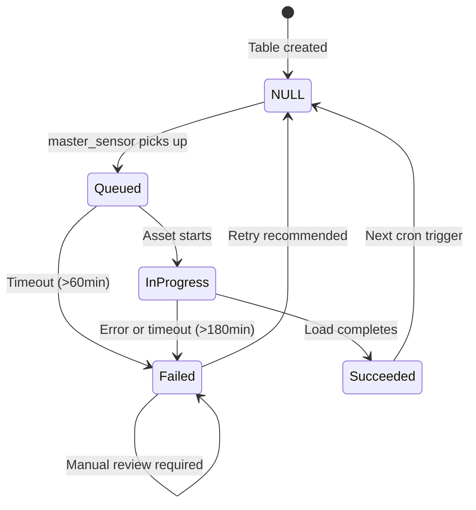

# Lakebase Control Database

Lakebase is the PostgreSQL control database that drives the DataLoader orchestration system.

---

## Overview

| Property | Value |
|----------|-------|
| **Engine** | PostgreSQL |
| **Production Database** | `dataloader` |
| **Pre-production Database** | `dataloader_test` |
| **Schema** | `control` |
| **Connection** | SSL required, 30s query timeout |

---

## Tables

### 1. table_control_dbconfig

Stores database connection configurations as JSONB.

```sql
CREATE TABLE control.table_control_dbconfig (
    db_config_key VARCHAR(100) PRIMARY KEY,
    db_config_value JSONB NOT NULL,
    db_type VARCHAR(50) NOT NULL,
    db_kv_scope VARCHAR(100) DEFAULT 'azure-keyvault',
    default_target_schema VARCHAR(255),

    -- Audit
    created_at TIMESTAMP DEFAULT CURRENT_TIMESTAMP,
    last_modified_at TIMESTAMP DEFAULT CURRENT_TIMESTAMP,
    create_user VARCHAR(255),
    last_modified_user VARCHAR(255)
);
```

**Key Columns**:

| Column | Type | Description |
|--------|------|-------------|
| `db_config_key` | VARCHAR(100) | Unique identifier (e.g., `sql_sales_prod`) |
| `db_config_value` | JSONB | Connection details (Key Vault secret names) |
| `db_type` | VARCHAR(50) | `mssql`, `oracle`, `postgresql`, `snowflake`, `snowflake_pem`, `clickhouse` |
| `db_kv_scope` | VARCHAR(100) | Key Vault scope for secret retrieval |
| `default_target_schema` | VARCHAR(255) | Default destination schema |

**db_config_value Structure** (stores Key Vault secret names, not actual values):

```json
{
  "host": "kv-secret-name-for-host",
  "port": "kv-secret-name-for-port",
  "database": "kv-secret-name-for-database",
  "user": "kv-secret-name-for-user",
  "password": "kv-secret-name-for-password"
}
```

---

### 2. table_control

Master orchestration table defining what tables to load and when.

```sql
CREATE TABLE control.table_control (
    -- Primary Key
    config_id BIGSERIAL PRIMARY KEY,

    -- Computed key (SHA-256 hash of source identifiers)
    control_key BYTEA GENERATED ALWAYS AS (
        digest(source_table_catalog || source_table_schema || source_table_name, 'sha256')
    ) STORED,

    -- Status & Control
    is_active BOOLEAN DEFAULT false NOT NULL,
    last_status VARCHAR(255),
    db_config_key VARCHAR(255),

    -- Source Identification
    source_table_catalog VARCHAR(255),
    source_table_schema VARCHAR(255),
    source_table_name VARCHAR(255),
    query TEXT,  -- Optional custom SQL

    -- Destination Identification
    destination_table_catalog VARCHAR(255),
    destination_table_schema VARCHAR(255),
    destination_table_name VARCHAR(255),

    -- Load Strategy
    load_strategy VARCHAR(255),
    load_full VARCHAR(255),
    load_cron VARCHAR(255),

    -- Incremental Configuration
    incremental_column TEXT,
    incremental_type VARCHAR(255),
    incremental_value VARCHAR(255),

    -- Rolling Configuration
    rolling_column TEXT,
    rolling_days INTEGER,

    -- Partitioning Configuration
    num_partitions INTEGER,
    partition_column TEXT,
    lower_bound VARCHAR(255),
    upper_bound VARCHAR(255),
    primary_key_cols TEXT,

    -- Timing & Status
    last_load_date_time TIMESTAMP,
    next_load_date_time TIMESTAMP,
    last_status_date_time TIMESTAMP,
    last_status_message TEXT,

    -- Run Tracking
    last_dagster_run VARCHAR(500),
    last_databricks_run VARCHAR(500),

    -- Audit
    created_at TIMESTAMP DEFAULT CURRENT_TIMESTAMP,
    last_modified_at TIMESTAMP DEFAULT CURRENT_TIMESTAMP,
    create_user VARCHAR(255),
    last_modified_user VARCHAR(255)
);
```

**Key Columns**:

| Column | Type | Description |
|--------|------|-------------|
| `config_id` | BIGSERIAL | Surrogate primary key |
| `control_key` | BYTEA | SHA-256 hash of source catalog+schema+table |
| `is_active` | BOOLEAN | Whether table is enabled for loading |
| `last_status` | VARCHAR | `Queued`, `In Progress`, `Succeeded`, `Failed` |
| `load_strategy` | VARCHAR | `full`, `incremental`, `append_only`, `rolling`, `check_and_load`, `chunked_backfill` |
| `incremental_value` | VARCHAR | Last processed value (updated after load) |
| `next_load_date_time` | TIMESTAMP | When sensor should trigger next load |

**Status Values**:

| Status | Meaning |
|--------|---------|
| `NULL` | Never run or reset for retry |
| `Queued` | Sensor picked up, waiting for execution |
| `In Progress` | Currently executing on Databricks |
| `Succeeded` | Last load completed successfully |
| `Failed` | Last load failed (check `last_status_message`) |

---

### 3. historical_metadata

Tracks execution history for all table loads.

```sql
CREATE TABLE control.historical_metadata (
    id BIGSERIAL PRIMARY KEY,
    control_key BYTEA NOT NULL,
    run_id VARCHAR(255),

    -- Timing
    load_queued_time TIMESTAMP,
    load_start_time TIMESTAMP,
    load_end_time TIMESTAMP,
    total_duration INTEGER,

    -- Table Identification
    source_catalog VARCHAR(255),
    source_schema VARCHAR(255),
    source_table VARCHAR(255),
    target_catalog VARCHAR(255),
    target_schema VARCHAR(255),
    target_table VARCHAR(255),

    -- Metrics
    rows_processed BIGINT DEFAULT 0,
    load_status VARCHAR(255),
    log_message TEXT,

    created_at TIMESTAMP DEFAULT CURRENT_TIMESTAMP
);
```

**Key Columns**:

| Column | Type | Description |
|--------|------|-------------|
| `control_key` | BYTEA | Links to table_control |
| `run_id` | VARCHAR | Dagster run ID |
| `load_queued_time` | TIMESTAMP | When job was queued |
| `load_start_time` | TIMESTAMP | When execution started |
| `load_end_time` | TIMESTAMP | When execution completed |
| `total_duration` | INTEGER | Duration in seconds |
| `rows_processed` | BIGINT | Number of rows loaded |
| `load_status` | VARCHAR | `Succeeded`, `Failed`, `Cancelled` |

---

### 4. table_control_history

Audit trail of all configuration changes.

```sql
CREATE TABLE control.table_control_history (
    history_id BIGSERIAL PRIMARY KEY,
    control_key BYTEA NOT NULL,
    config_id BIGINT,
    changed_at TIMESTAMP DEFAULT CURRENT_TIMESTAMP,
    changed_by VARCHAR(255),
    change_type VARCHAR(20) NOT NULL,
    change_source VARCHAR(50),
    old_values JSONB,
    new_values JSONB,
    changed_fields TEXT[]
);
```

**Key Columns**:

| Column | Type | Description |
|--------|------|-------------|
| `change_type` | VARCHAR | `INSERT`, `UPDATE`, `DELETE` |
| `change_source` | VARCHAR | `bulk_edit`, `single_edit`, `clone`, `status_reset`, `toggle_active`, `promotion` |
| `old_values` | JSONB | Previous field values (null for INSERT) |
| `new_values` | JSONB | New field values (null for DELETE) |
| `changed_fields` | TEXT[] | Array of modified field names |

---

## Views

### table_control_history_vw

Enriched history view with table names joined.

```sql
SELECT
    h.history_id,
    h.config_id,
    encode(h.control_key, 'hex') as control_key_hex,
    t.db_config_key,
    t.source_table_name,
    h.changed_at,
    h.changed_by,
    h.change_type,
    h.change_source,
    h.old_values,
    h.new_values,
    h.changed_fields
FROM control.table_control_history h
LEFT JOIN control.table_control t ON h.config_id = t.config_id;
```

---

## Status Lifecycle



---

## Common Queries

### Ready Tables (Sensor Query)

```sql
SELECT *
FROM control.table_control
WHERE is_active = true
  AND next_load_date_time <= CURRENT_TIMESTAMP
  AND (last_status IS NULL OR last_status NOT IN ('Queued', 'In Progress'))
ORDER BY next_load_date_time
LIMIT 10;
```

### Failed Loads

```sql
SELECT
    source_table_name,
    destination_table_name,
    last_status,
    last_status_message,
    last_status_date_time
FROM control.table_control
WHERE last_status = 'Failed'
ORDER BY last_status_date_time DESC;
```

### Long Queued Jobs

```sql
SELECT *
FROM control.table_control
WHERE last_status = 'Queued'
  AND last_status_date_time < CURRENT_TIMESTAMP - INTERVAL '60 minutes';
```

### Long Running Jobs

```sql
SELECT *
FROM control.table_control
WHERE last_status = 'In Progress'
  AND last_load_date_time < CURRENT_TIMESTAMP - INTERVAL '180 minutes';
```

### Execution History

```sql
SELECT
    source_table,
    load_status,
    rows_processed,
    total_duration,
    load_start_time
FROM control.historical_metadata
WHERE control_key = (
    SELECT control_key
    FROM control.table_control
    WHERE source_table_name = 'orders'
    LIMIT 1
)
ORDER BY load_start_time DESC
LIMIT 10;
```

### Recent Changes

```sql
SELECT
    table_name,
    change_type,
    change_source,
    changed_by,
    changed_at,
    changed_fields
FROM control.table_control_history_vw
ORDER BY changed_at DESC
LIMIT 20;
```

### Tables by Status

```sql
SELECT
    last_status,
    COUNT(*) as count
FROM control.table_control
WHERE is_active = true
GROUP BY last_status;
```

---

## Indexes

| Table | Index | Purpose |
|-------|-------|---------|
| `table_control` | `idx_table_control_control_key` | Join with historical_metadata |
| `table_control_history` | `idx_history_control_key` | Query changes by table |
| `table_control_history` | `idx_history_config_id` | Query by config_id |
| `table_control_history` | `idx_history_changed_at` | Time-based queries |
| `table_control_history` | `idx_history_changed_by` | User tracking |

---

## Foreign Keys

| Child Table | Parent Table | On Delete | On Update |
|-------------|--------------|-----------|-----------|
| `table_control.db_config_key` | `table_control_dbconfig.db_config_key` | SET NULL | CASCADE |

---

## Related Documentation

- [System Overview](01-system-overview.md) - High-level architecture
- [Dagster Orchestration](03-dagster-orchestration.md) - How sensors query these tables
- [Architecture Diagrams](../diagrams/02-architecture.md) - Visual component diagrams
