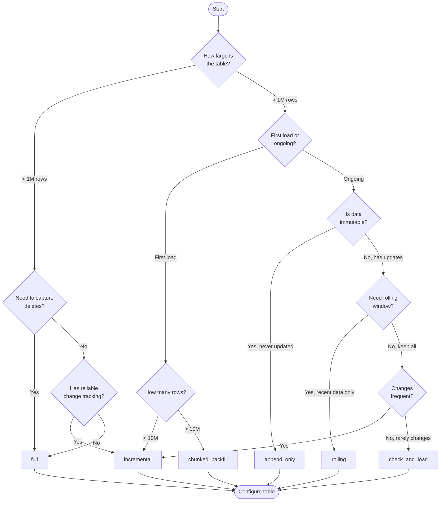

# Load Strategies Guide

DataLoader supports 6 load strategies for different use cases.

---

## Decision Tree



---

## Strategy Comparison

| Strategy | Use Case | Captures Deletes | Required Fields | Performance |
|----------|----------|------------------|-----------------|-------------|
| `full` | Small tables, no tracking | Yes | None | Slow for large |
| `incremental` | Large tables with timestamps | No | incremental_column, primary_key_cols | Fast |
| `append_only` | Immutable event data | No | incremental_column | Fastest |
| `rolling` | Time-windowed data | Yes (in window) | rolling_column, rolling_days, primary_key_cols | Medium |
| `check_and_load` | Rarely changing tables | No | incremental_column, primary_key_cols | Fast (skips if no changes) |
| `chunked_backfill` | Large initial loads | No | incremental_column | Slow but memory-safe |

---

## Strategy Details

### 1. full

**When to Use**:
- Small dimension tables (< 1M rows)
- Tables without reliable change tracking
- Need to capture deletes

**How It Works**:
1. Truncate destination table
2. Load all rows from source
3. Write with overwrite mode

**Required Fields**: None (basic source/destination only)

**SQL Pattern**:
```sql
SELECT * FROM source_table
```

**Write Mode**: `overwrite`

**Pros**:
- Simple and reliable
- Captures all changes including deletes

**Cons**:
- Inefficient for large tables
- Higher source database load

**Example Use Cases**:
- Employee directory
- Product catalog
- Reference/lookup tables

**Configuration**:
```sql
INSERT INTO table_control (
    source_table_schema, source_table_name,
    destination_table_catalog, destination_table_schema, destination_table_name,
    load_strategy, load_cron, is_active
) VALUES (
    'dbo', 'employees',
    'bronze', 'hr', 'employees',
    'full', '0 2 * * *', true
);
```

---

### 2. incremental

**When to Use**:
- Large fact tables with timestamp or ID tracking
- Tables with reliable `modified_date` or auto-increment columns
- Need efficient delta processing

**How It Works**:
1. Query last `incremental_value` from Lakebase
2. Filter source: `WHERE column > last_value`
3. Merge into destination using primary keys
4. Update `incremental_value` with MAX(column)

**Required Fields**:
- `incremental_column`: Column to track changes
- `incremental_type`: `timestamp` or `integer`
- `primary_key_cols`: Comma-separated list for merge

**Optional Fields**:
- `partition_column`: For parallel JDBC reads
- `lower_bound`, `upper_bound`: Partition bounds
- `num_partitions`: Parallel read count (default: 12)

**SQL Pattern**:
```sql
-- PostgreSQL
SELECT * FROM source_table
WHERE modified_date > ('2024-01-15 10:30:00'::timestamp + INTERVAL '1 second')

-- SQL Server
SELECT * FROM source_table
WHERE modified_date > CAST('2024-01-15 10:30:00' AS DATETIME2)
```

**Write Mode**: Delta MERGE (upsert)

**Pros**:
- Efficient for large tables
- Low source database impact
- Fast execution times

**Cons**:
- Requires reliable change tracking column
- Doesn't capture deletes (unless soft-deleted)

**Example Use Cases**:
- Sales orders (millions of rows)
- Customer transactions
- IoT sensor data

**Configuration**:
```sql
INSERT INTO table_control (
    source_table_schema, source_table_name,
    destination_table_catalog, destination_table_schema, destination_table_name,
    load_strategy, incremental_column, incremental_type, incremental_value,
    primary_key_cols, load_cron, is_active
) VALUES (
    'dbo', 'orders',
    'bronze', 'sales', 'orders',
    'incremental', 'modified_date', 'timestamp', '2024-01-01 00:00:00',
    'order_id', '0 */4 * * *', true
);
```

---

### 3. append_only

**When to Use**:
- Immutable data (never updated or deleted)
- Log tables, audit trails, sensor data
- When merge operation is not needed

**How It Works**:
1. Query last `incremental_value`
2. Filter source: `WHERE column > last_value`
3. Append to destination (no merge, no deduplication)
4. Update `incremental_value`

**Required Fields**:
- `incremental_column`
- `incremental_type`

**SQL Pattern**: Same as incremental

**Write Mode**: `append`

**Pros**:
- Fastest load strategy
- No primary key required
- Simple and predictable

**Cons**:
- Cannot handle updates
- Cannot handle deletes
- Potential duplicates if re-run

**Example Use Cases**:
- Application logs
- Clickstream events
- Sensor readings
- Audit trails

**Configuration**:
```sql
INSERT INTO table_control (
    source_table_schema, source_table_name,
    destination_table_catalog, destination_table_schema, destination_table_name,
    load_strategy, incremental_column, incremental_type, incremental_value,
    load_cron, is_active
) VALUES (
    'dbo', 'audit_log',
    'bronze', 'audit', 'application_events',
    'append_only', 'event_timestamp', 'timestamp', '2024-01-01 00:00:00',
    '*/15 * * * *', true
);
```

---

### 4. rolling

**When to Use**:
- Time-series data with fixed retention window
- Need to maintain only recent data
- Dashboards focused on recent periods

**How It Works**:
1. Calculate window: `TODAY - rolling_days`
2. Filter source: `WHERE column >= window_start`
3. Merge with WHEN NOT MATCHED BY SOURCE DELETE
4. Records outside window automatically deleted

**Required Fields**:
- `rolling_column`: Timestamp column for window
- `rolling_days`: Window size in days (e.g., 7, 30, 90)
- `primary_key_cols`: For merge operation

**SQL Pattern**:
```sql
SELECT * FROM source_table
WHERE event_date >= (CURRENT_DATE - INTERVAL '30 days')
```

**Write Mode**: Delta MERGE with DELETE

**Pros**:
- Maintains fixed-size datasets
- Automatically drops old data
- Good for dashboards with recent data focus

**Cons**:
- Loses historical data
- Not suitable for long-term analysis

**Example Use Cases**:
- Last 7 days of website traffic
- Last 30 days of system metrics
- Last 90 days of customer interactions

**Configuration**:
```sql
INSERT INTO table_control (
    source_table_schema, source_table_name,
    destination_table_catalog, destination_table_schema, destination_table_name,
    load_strategy, rolling_column, rolling_days,
    primary_key_cols, load_cron, is_active
) VALUES (
    'dbo', 'page_views',
    'bronze', 'analytics', 'recent_page_views',
    'rolling', 'view_timestamp', 30,
    'view_id', '0 */6 * * *', true
);
```

---

### 5. check_and_load

**When to Use**:
- Tables that change infrequently
- Want to skip load if no new data
- Reduce unnecessary processing

**How It Works**:
1. Query `COUNT(*)` of changes since last value
2. If count > 0: Execute incremental load
3. If count = 0: Skip load entirely

**Required Fields**: Same as `incremental`

**SQL Pattern**:
```sql
-- First: Check for changes
SELECT COUNT(*) FROM source_table
WHERE modified_date > '2024-01-15 10:30:00'

-- If count > 0: Load data
SELECT * FROM source_table
WHERE modified_date > '2024-01-15 10:30:00'
```

**Write Mode**: Conditional MERGE

**Pros**:
- Skips empty loads
- Reduces unnecessary processing
- Good for monitoring changes

**Cons**:
- Additional query overhead
- Same limitations as incremental

**Example Use Cases**:
- Configuration tables
- Master data with infrequent changes
- Reference data updated weekly

**Configuration**:
```sql
INSERT INTO table_control (
    source_table_schema, source_table_name,
    destination_table_catalog, destination_table_schema, destination_table_name,
    load_strategy, incremental_column, incremental_type,
    primary_key_cols, load_cron, is_active
) VALUES (
    'dbo', 'product_categories',
    'bronze', 'products', 'categories',
    'check_and_load', 'last_updated', 'timestamp',
    'category_id', '0 6 * * *', true
);
```

---

### 6. chunked_backfill

**When to Use**:
- Large initial loads (10M+ rows)
- Tables too large for single load
- Memory-constrained environments

**How It Works**:
1. Query source MIN/MAX of incremental column
2. Calculate chunk boundaries based on type
3. Process chunks sequentially
4. First chunk: overwrite, subsequent: append
5. Update `incremental_value` at completion
6. **After completion**: Automatically switches to `incremental`

**Required Fields**:
- `incremental_column`
- `incremental_type`
- `primary_key_cols` (for future incremental)

**Optional Fields**:
- `num_partitions`: Override auto-calculated chunks

**Chunk Calculation**:
- **Timestamps**: ~30 days per chunk
- **Integers**: ~100,000 rows per chunk (estimated)

**Write Mode**: First overwrite, then append

**Pros**:
- Handles billions of rows
- Memory-safe processing
- Resumable on failure
- Automatic strategy transition

**Cons**:
- Slower than single load
- Sequential processing (no parallelism within table)

**Example Use Cases**:
- Historical data migration
- Initial table onboarding
- Large fact table backfills

**Configuration**:
```sql
INSERT INTO table_control (
    source_table_schema, source_table_name,
    destination_table_catalog, destination_table_schema, destination_table_name,
    load_strategy, incremental_column, incremental_type,
    primary_key_cols, load_cron, is_active
) VALUES (
    'dbo', 'transactions_historical',
    'bronze', 'finance', 'transactions',
    'chunked_backfill', 'transaction_id', 'integer',
    'transaction_id', '0 2 * * *', true
);

-- After backfill completes, DataLoader automatically changes:
-- load_strategy = 'incremental'
-- incremental_value = (max value from backfill)
```

---

## Required Fields Summary

| Strategy | incremental_column | incremental_type | primary_key_cols | rolling_column | rolling_days |
|----------|-------------------|------------------|------------------|----------------|--------------|
| full | - | - | - | - | - |
| incremental | Required | Required | Required | - | - |
| append_only | Required | Required | - | - | - |
| rolling | - | - | Required | Required | Required |
| check_and_load | Required | Required | Required | - | - |
| chunked_backfill | Required | Required | Required | - | - |

---

## Related Documentation

- [System Overview](01-system-overview.md) - Architecture context
- [DataLoader Class](04-dataloader-class.md) - Implementation details
- [Sequence Diagrams](../diagrams/03-sequence-diagrams.md) - Visual flows
- [Troubleshooting](06-troubleshooting.md) - Debugging strategies
