# Control Manager UI (dl-app)

Web interface for managing Lakebase control tables. A development/testing tool for configuring and monitoring data loads.

---

## Overview

The Control Manager provides a GUI for:
- Configuring database connections
- Defining table load configurations
- Monitoring execution status
- Bulk editing configurations
- Promoting configurations between test and production

**URL**: `http://localhost:5000` (local development only)

**Start Command**:
```bash
cd dl-app && python app.py
```

---

## Dashboard

The main dashboard displays database configurations as cards with KPI metrics.

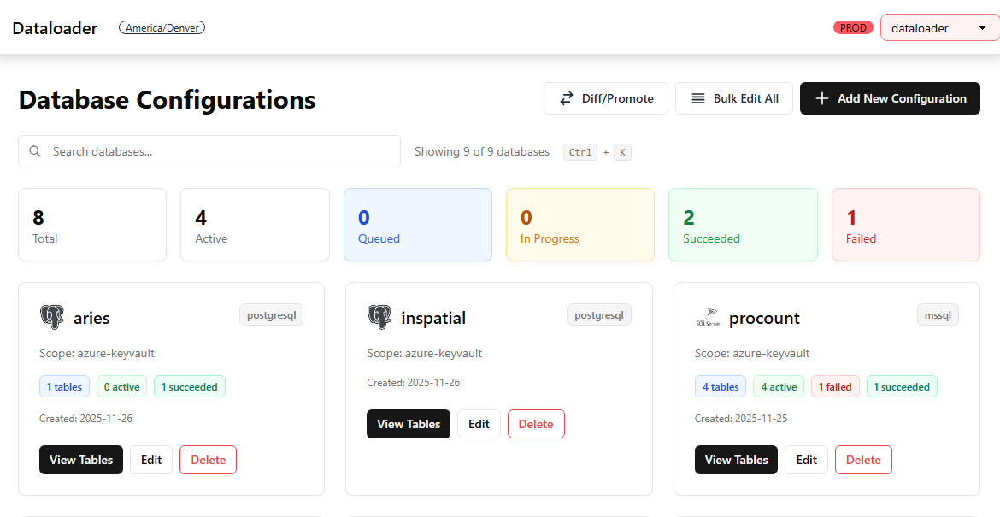

**Features**:
- **Database cards**: One card per `table_control_dbconfig` entry
- **KPI metrics**: Total tables, active, queued, in progress, succeeded, failed
- **Quick actions**: View tables, create new config, bulk edit
- **Environment switcher**: Toggle between Test and Production databases (header dropdown)

**KPI Cards** (clickable to filter):
| Status | Color | Meaning |
|--------|-------|---------|
| Total | Gray | All tables for this database |
| Active | Green | Tables with `is_active = true` |
| Queued | Blue | Waiting to run |
| In Progress | Amber | Currently executing |
| Succeeded | Green | Last run successful |
| Failed | Red | Last run failed |

---

## Database Configuration


Shows all database configurations with:
- Database type icon (SQL Server, Oracle, PostgreSQL, Snowflake, ClickHouse)
- Config key (unique identifier)
- Connection scope (dev, pre_prod, prd)
- Table count

**Required Fields** (when creating):
| Field | Description |
|-------|-------------|
| Config Key | Unique identifier (e.g., `sales_mssql_prod`) |
| Database Type | mssql, oracle, postgresql, snowflake, snowflake_pem, clickhouse |
| Config Scope | dev, pre_prod, prd |

**Connection Fields** (stored in Azure Key Vault):
| Field | Description |
|-------|-------------|
| Host | Key Vault secret name for hostname |
| Port | Key Vault secret name for port |
| Database | Key Vault secret name for database name |
| User | Key Vault secret name for username |
| Password | Key Vault secret name for password |

**Optional Fields**:
| Field | Description |
|-------|-------------|
| Default Target Schema | Default destination schema for new tables |
| KV Scope | Azure Key Vault scope name |

---

## Table Configuration

### Table List

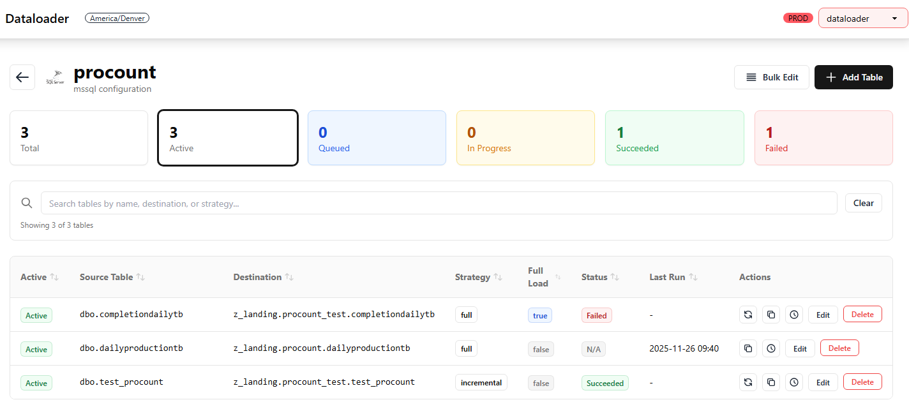

Displays all tables for a database configuration with:
- Source and destination table names
- Load strategy badge
- Status badge (clickable for error details)
- Active toggle
- Last run timestamp
- Action buttons (Edit, Clone, Reset)

**Filtering**:
- Click KPI cards to filter by status
- Search box for table name filtering

### Create Table

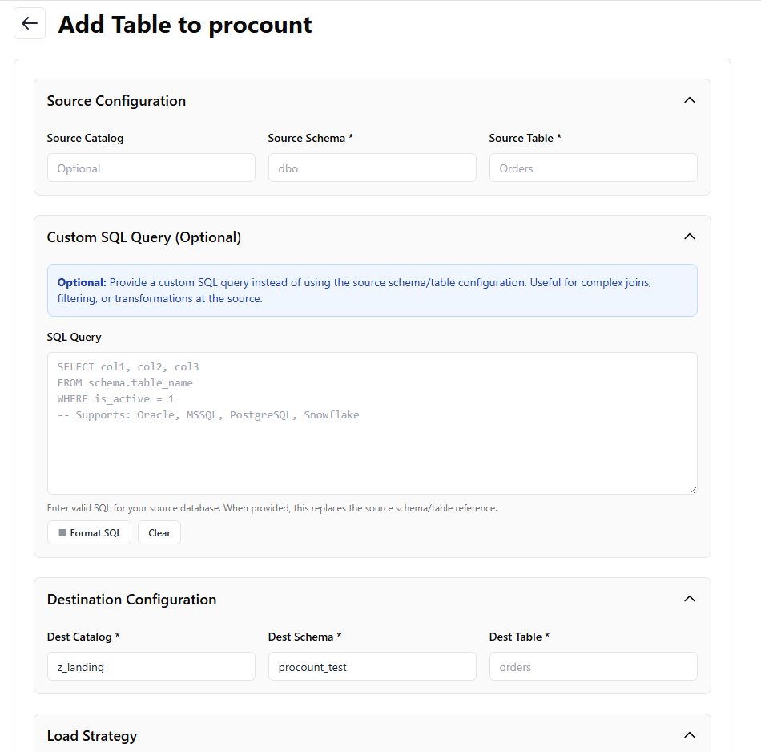

**Source Configuration**:
| Field | Description |
|-------|-------------|
| Source Schema | Schema name in source database |
| Source Table | Table name in source database |

**Destination Configuration**:
| Field | Description |
|-------|-------------|
| Destination Catalog | Unity Catalog name (default: `bronze`) |
| Destination Schema | Schema in Unity Catalog |
| Destination Table | Table name (auto-copies from source, lowercase) |

**Load Strategy** (form adapts dynamically):

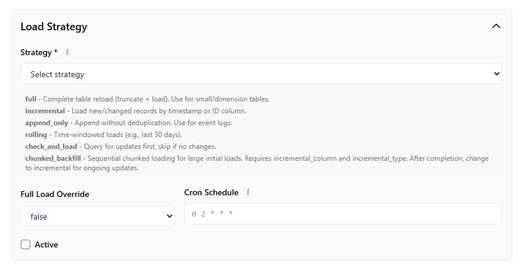

| Strategy | Required Fields |
|----------|-----------------|
| full | None (basic config only) |
| incremental | Incremental Column, Incremental Value, Primary Key Columns |
| append_only | Incremental Column, Incremental Value |
| rolling | Rolling Window Size, Incremental Column, Primary Key Columns |
| check_and_load | Same as incremental |
| chunked_backfill | Chunk Column, Chunk Size, Primary Key Columns |

**Scheduling**:
| Field | Description |
|-------|-------------|
| Cron Expression | Standard 5-field cron (e.g., `0 2 * * *`) |
| Live Description | Shows human-readable interpretation |

**Status**:
| Field | Description |
|-------|-------------|
| Active | Enable/disable table pickup by sensor |
| Force Full Load | Override strategy for next run |

### Error Modal

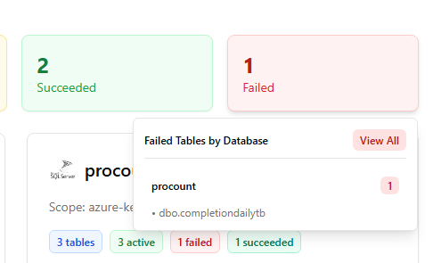

Click a red "Failed" status badge to see:
- Full error message
- Dagster run link
- Databricks job link

---

## Bulk Edit

### Per-Database Bulk Edit

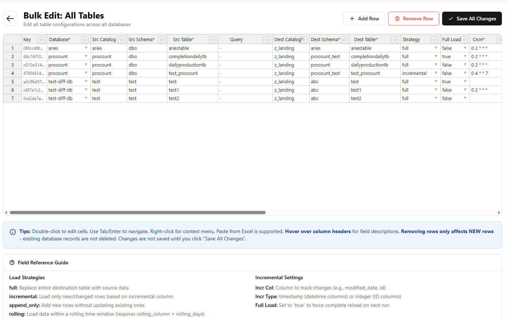

Spreadsheet-style editing for all tables in a database configuration.

**Features**:
- Edit cells directly in spreadsheet
- Modified rows highlighted
- Validation on save
- Change detection (only saves modified rows)

**Editable Columns**:
- Active, Force Full Load
- Load Strategy
- Incremental Column, Incremental Value
- Primary Key Columns
- Cron Expression
- Rolling Window Size

### Global Bulk Edit

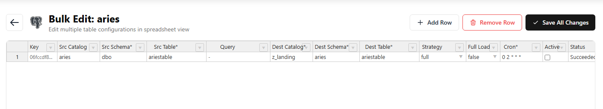

Edit tables across all database configurations. Same features as per-database, with database key column added.

---

## Promotion Workflow

### Diff View

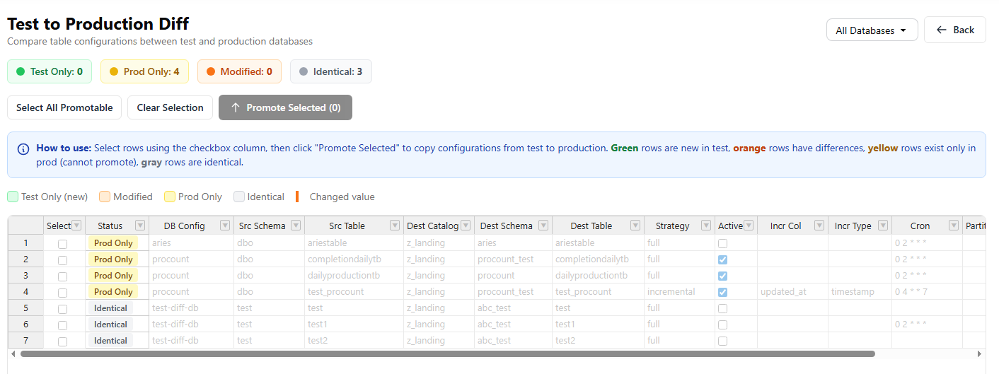

Compare test vs production configurations side-by-side.

**Categories**:
| Category | Meaning |
|----------|---------|
| Test Only | Exists in test, not in prod |
| Prod Only | Exists in prod, not in test |
| Modified | Different values between environments |
| Identical | Same configuration in both |

**Actions**:
1. Select configurations to promote
2. Review changes in diff view
3. Click "Promote Selected"
4. Changes logged to `table_control_history`

---

## Status Overview

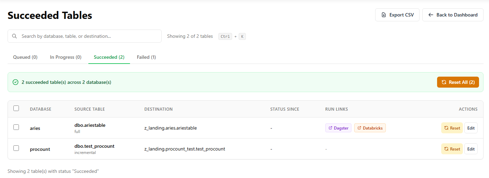

View all tables with a specific status across all databases.

**Features**:
- Filter by status (Queued, In Progress, Succeeded, Failed)
- See tables from all database configurations
- Bulk reset failed tables

### Reset Actions

**Single Table Reset**:
- Click "Reset" button on table row
- Status changes to NULL (eligible for next sensor run)

**Bulk Reset (Per Database)**:
- Click "Reset All Failed" on table list
- Resets all failed tables for that database

**Bulk Reset (Global)**:
- Navigate to Status Overview for Failed
- Click "Reset All Failed Across All Databases"
- Resets all failed tables in all databases

---

## History Tracking

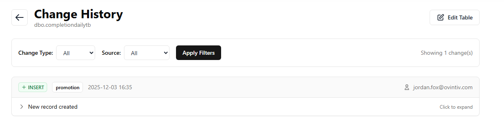

All changes are logged to `table_control_history` with:

| Field | Description |
|-------|-------------|
| control_key | Table identifier |
| changed_at | Timestamp |
| change_type | INSERT, UPDATE, DELETE |
| change_source | bulk_edit, single_edit, clone, promotion, etc. |
| old_values | JSONB of previous values |
| new_values | JSONB of new values |
| changed_by | User email from environment |

**Query History**:
```sql
SELECT * FROM control.table_control_history_vw
WHERE control_key = 'your_table'
ORDER BY changed_at DESC;
```

---

## Environment Switching

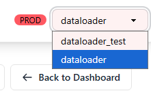

Toggle between Test and Production databases using the dropdown in the header.

| Environment | Database |
|-------------|----------|
| Test | `dataloader_test` |
| Production | `dataloader` |

Session persists until changed or browser closed.

---

## Technology Stack

| Component | Technology |
|-----------|------------|
| Backend | Flask 3.0+ |
| Database | PostgreSQL (psycopg v3) |
| Frontend | Tailwind CSS + DaisyUI |
| Dynamic UI | HTMX 2.0 |
| Spreadsheet | Handsontable |
| Cron | croniter + cronstrue |

---

## Quick Start

1. **Install dependencies**:
   ```bash
   uv pip install -e ".[dl-app]"
   ```

2. **Configure environment** (`dl-app/.env`):
   ```env
   SECRET_KEY=your-secret-key
   LAKEBASE_HOST=lakebase.postgres.database.azure.com
   LAKEBASE_PORT=5432
   LAKEBASE_DATABASE_TEST=dataloader_test
   LAKEBASE_DATABASE_PROD=dataloader
   LAKEBASE_USER_TEST=dataloader_test
   LAKEBASE_PASSWORD_TEST=your-test-password
   LAKEBASE_USER_PROD=dataloader
   LAKEBASE_PASSWORD_PROD=your-prod-password
   CURRENT_USER=your.email@company.com
   ```

3. **Run the application**:
   ```bash
   cd dl-app && python app.py
   ```

4. **Open browser**: http://localhost:5000

---

## Related Documentation

- [System Overview](01-system-overview.md) - Architecture context
- [Lakebase Reference](02-lakebase-control-database.md) - Control table details
- [Load Strategies](05-load-strategies.md) - Strategy configuration
- [Troubleshooting](06-troubleshooting.md) - Common issues
